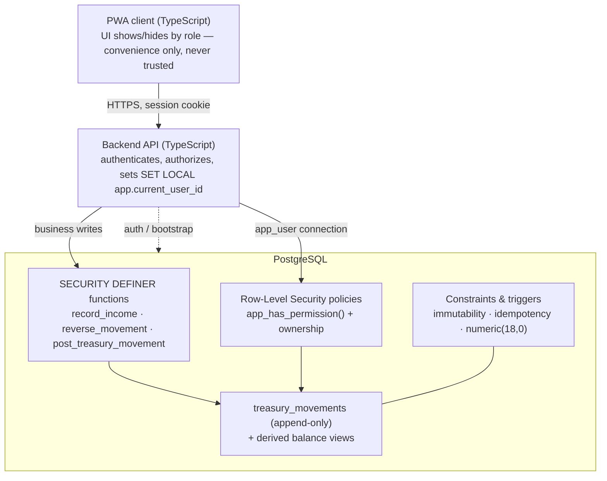

# SEPF Treasury — Technical Architecture (Foundation milestone)

> **Status:** draft for review. Covers **Milestone 2 — Foundation** of the spec
> (§16): *authentication, roles, permissions, treasury accounts and the financial
> ledger*. The acceptance criterion is *"five roles can log in and balances are
> calculated."* The SQL in [`db/`](../db) has been loaded and exercised on
> PostgreSQL 16; see [Validation](#validation).

This document explains **what we are building, how it is layered, and why the
financial-integrity decisions are made the way they are**. It deliberately maps
each decision back to the specification (e.g. *§5.4*) so SEPF can confirm
compliance module by module (§19.1).

---

## 1. Recommended stack

| Layer | Recommendation | Rationale |
|---|---|---|
| Frontend | **TypeScript + React (Vite) as an installable PWA**, or Next.js if SSR is wanted | §14.1 "modern TypeScript frontend", PWA installable (§3.1). Mobile-first (§12.1). |
| Backend | **TypeScript API** (Next.js route handlers / Node + Fastify) | One language across the stack; server-side authorization (§14.2). |
| Database | **PostgreSQL** | §14.1. Strong constraints, RLS and transactional functions enforce the rules *in the data layer*, not just the app. |
| File storage | Private bucket with **time-limited signed URLs** (S3-compatible or Supabase Storage) | §14.1 "private storage … with temporary URLs". *Documents arrive in milestone 4; not in this draft.* |
| Hosting | Provider owned by SEPF (§18.2) | The Git repo, DB, storage and domain must belong to SEPF. |

**Why so much logic lives in the database.** The spec is emphatic that balances
must be derived, movements immutable, payments exact, and duplicates impossible
(§5.4, §13.1), and that *"no sensitive permission relies solely on the user
interface"* (§2.1, §14.2). The most reliable way to guarantee that across any
future client or script is to enforce it in PostgreSQL itself — via constraints,
row-level security and `SECURITY DEFINER` transactional functions — with the API
as a second, earlier line of defence.

> An equivalent **Supabase** deployment (Postgres + Auth + Storage + RLS) maps
> onto this design almost 1:1: `app_current_user_id()` becomes `auth.uid()`,
> `service_role`/`app_user` already exist, and Storage provides the signed URLs.
> The SQL here is written in portable PostgreSQL so either path works.

---

## 2. Component overview



Two database roles back the application (created in
[`0007_roles_grants.sql`](../db/migrations/0007_roles_grants.sql)):

- **`app_user`** — normal business requests. Bound by RLS. Cannot write the
  ledger directly; it must call the transactional functions. On every
  transaction the backend runs `SET LOCAL app.current_user_id = '<uuid>'`.
- **`service_role`** — trusted path (BYPASSRLS) for authentication, session
  issuance and one-off administrative bootstrap.

---

## 3. Authorization model (defence in depth)

Four layers, from least to most authoritative:

1. **UI** — hides actions a role cannot perform. Convenience only; never trusted.
2. **API** — verifies the session and the permission before doing any work.
3. **Database roles + RLS** — `app_user` is default-deny; a row is visible/
   writable only if a policy backed by `app_has_permission()` (or ownership)
   allows it. This holds *even if the API is bypassed* (§14.2 "checked … in the
   database", "protection against … unauthorised direct access").
4. **`SECURITY DEFINER` functions** — every financial posting goes through one.
   They re-check authority, enforce idempotency, and are the *only* way to write
   the ledger. `app_user` has no `INSERT` on `treasury_movements` at all.

The §4.2 permission matrix is modelled as **discrete permission codes**
(`income.record.small`, `movement.reverse`, …) in the `permissions` table, joined
to roles via `role_permissions`. See [Open decisions](#6-open-decisions--assumptions)
for why the matrix needs clarification before it is completed.

---

## 4. Financial-integrity model

| Principle (spec) | How it is enforced |
|---|---|
| Balances are **derived**, never stored editable (§5.4) | `treasury_movements` is the only source of truth; `treasury_balances` / `treasury_consolidated` are **views** = `opening_balance + Σ signed amounts`. |
| Movements are **immutable** (§5.4, §13.1) | `trg_block_modification` trigger rejects every `UPDATE`/`DELETE`; `app_user` is granted `SELECT` only. |
| Corrections only via **reversal/adjustment** (§5.4) | `reverse_movement()` posts an opposite-signed, linked movement; a movement can be reversed at most once (partial unique index + guard). |
| **No duplicate** financial movements (§13.1) | `idempotency_key` is `UNIQUE NOT NULL`; `post_treasury_movement()` returns the existing row on replay; the audit entry is written **exactly once** per movement. |
| Amounts are **integers**, never float (§13.1) | `numeric(18,0)` everywhere; FCFA has no minor unit, displayed without decimals (§12.1). |
| **Consolidated total is conserved** by transfers (§10.3) | Funds-in-transit is a first-class account; transfers will post balanced legs sharing a `movement_group_id`, so small + large + transit is invariant. *(Transfers are milestone 4; the ledger already supports the legs.)* |
| Everything is **attributed and timestamped** (§2.1) | `posted_by` + `posted_at` on every movement; append-only `audit_logs` with before/after JSONB. |

---

## 5. Validation

The schema is not just written — it has been loaded into PostgreSQL 16 and
exercised by [`db/tests/0001_foundation_checks.sql`](../db/tests/0001_foundation_checks.sql).
All checks pass:

- balances derive correctly (small 150 000 + large 5 000 000 = 5 150 000 FCFA);
- idempotent re-posting creates **no** duplicate and **no** extra audit row;
- the ledger rejects `UPDATE` and `DELETE`;
- a Cashier sees only the small treasury + funds in transit (RLS), cannot record
  large-treasury income, and cannot reverse a movement;
- a reversal requires a reason, is idempotent, balances the account, and cannot
  be applied twice.

```bash
# local quick start (throwaway database)
createdb sepf
for f in db/migrations/*.sql db/seed/*.sql; do psql -d sepf -f "$f"; done
psql -d sepf -f db/tests/0001_foundation_checks.sql
```

---

## 6. Open decisions & assumptions

These come straight from the specification review and **should be confirmed by
SEPF in writing before later milestones** (§19.1 forbids the contractor from
inventing rules):

1. **§4.2 matrix legend.** The matrix mixes `Yes/No` with undefined values
   (`Read`, `Control`, `Monitor`, `Limited`). It is modelled here as discrete
   permissions; the exact mapping for those cells, and **who may create a
   reversal/adjustment** (absent from §13.2's authority list), need confirming.
   *Provisional:* reversal authority = Super Administrator only; full audit-trail
   read = Super Administrator + First-Level Validator (§11.1).
2. **Cashier advance ceiling (§6.5).** The "already disbursed" path has no limit
   in the spec. A `settings` key `advance_disbursement_ceiling_fcfa` is seeded
   (0 = disabled) so a limit can be switched on without code changes.
3. **Approver availability.** With only two mandatory approvers and no delegation
   (§4.1), the Super Administrator being unavailable blocks all final approvals.
   A deputy mechanism may be needed.
4. **Auth provider.** App-managed credentials vs. an external provider
   (e.g. Supabase Auth). The `users` table supports both; MFA on sensitive
   actions is recommended but unspecified.
5. **Transfer failure path (§5.3/§10.3).** No reject/expire flow is defined for a
   transfer stuck in funds-in-transit; to be designed in milestone 4.

---

## 7. Repository layout

```
db/
  migrations/   0001..0007  ordered, idempotent DDL (apply in filename order)
  seed/         0001..0003  roles/permissions, the 5 users + 3 treasuries, demo data
  tests/        0001        foundation acceptance checks (psql)
docs/
  ARCHITECTURE.md   this file
  DATA_MODEL.md     ERD, table catalogue, integrity-rule traceability
```

## 8. Mapping to later milestones

The foundation deliberately leaves hooks for the rest of the spec: the generic
`post_treasury_movement()` engine, the `movement_type` vocabulary, and
`source_type` / `source_id` / `movement_group_id` let requests, payments,
transfers, salaries, investments, capital, loans and borrowings (§6–§10) be added
**without** touching the ledger's integrity guarantees.
