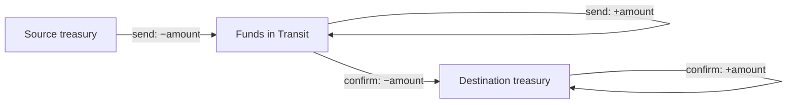

# SEPF Treasury — Controls & Transfers (Milestone 4)

Scope: accounting control (§7.2), supporting documents (§7.1), internal receipts
(§7.4) and manual treasury transfers with funds in transit (§10.3 / §5.3).
Validated on PostgreSQL 16 — see [Validation](#validation).

## Accounting control (§7.2)

The Accountant has exactly two decisions, recorded in append-only
`accounting_controls`:

| Decision | Rule |
|---|---|
| `validated` | The expense is properly supported and correctly recorded. |
| `not_validated` | A **cause is mandatory** (`chk_control_cause` + function check). |

A control has **no financial effect**: it posts no movement, never credits the
treasury and never creates a refund (§7.2). The test proves the balance is
identical before and after a `not_validated` control. The latest control per
payment is exposed by the `payment_control_status` view.

## Supporting documents (§7.1)

`attachments` is polymorphic (any `entity_type`/`entity_id`). Content is
immutable — a correction is a **replacement** that preserves the original
(`is_active = false`, linked via `replaced_by_id`) and is fully audited. Reuse of
the same file is detected by `sha256`: `add_attachment` flags
`is_potential_duplicate` and records `duplicate_of_id` (detect, not block — §7.1).

## Internal receipts (§7.4)

An internal beneficiary may state `received` / `not_received` / `disputed` via
`confirm_internal_receipt`; only the beneficiary of that payment may do so. It
**never** posts a second treasury movement.

## Manual transfers (§10.3)

No transfer is automatic and no percentage is imposed. Two steps, each balanced,
so the **consolidated total is invariant**:

| Direction | Initiator | Confirmer |
|---|---|---|
| small → large | Cashier | Accountant |
| large → small | Accountant | Cashier |



The four legs (two on send, two on confirm) share the transfer id as
`movement_group_id`. On send the source decreases and transit increases; on
confirm transit decreases and the destination increases. The confirmed amount
equals the amount sent (same row), partial transfers are impossible, and
`initiate_transfer` checks the source balance first (§6.7). Both
`initiate_transfer` (keyed) and `confirm_transfer` (status-guarded) are
idempotent.

### Cancel safeguard (proposed — needs SEPF sign-off)

The spec defines no path for a transfer that is never confirmed, leaving funds
stranded in transit (flagged in the spec review). `cancel_transfer` is provided
as a safeguard: the **initiator only**, while still `pending`, reverses the
transit leg back to the source — conserving the consolidated total. It is the
exact inverse of the send, not a new money flow, but per §19.1 it must be
confirmed by SEPF before production use.

## Specification traceability

| Spec | Where enforced |
|---|---|
| §7.1 evidence, original preserved, replacement audited, hash reuse | `attachments` + freeze trigger + `add_attachment`/`replace_attachment` |
| §7.2 two decisions; cause mandatory; no financial effect | `accounting_controls` + `record_accounting_control` |
| §7.4 internal acknowledgement; no second movement | `internal_receipts` + `confirm_internal_receipt` |
| §10.3 direction/initiator/confirmer; send/confirm legs | `internal_transfers` + `initiate_transfer`/`confirm_transfer` |
| §10.3 confirmed = sent; no partial; total invariant | single amount row; four balanced legs sharing the group id |
| §5.3 funds in transit is a real account | seeded `funds_in_transit` treasury |

## Validation

`db/tests/0003_controls_transfers_checks.sql` (all pass):

- a `not_validated` control needs a cause and leaves the balance unchanged;
- a non-Accountant cannot control; a non-beneficiary cannot acknowledge receipt;
- a small→large transfer keeps the consolidated total constant on **send** and on
  **confirm**; wrong-role initiate/confirm is rejected; insufficient funds is
  rejected; the send/confirm are idempotent;
- the cancel safeguard returns funds to source (total constant) and a cancelled
  transfer can no longer be confirmed;
- a reused file hash is flagged on the second upload.

The consolidated total stays **constant at 5 135 000** across every transfer
phase (after the two setup payments of 10 000 + 5 000).

```bash
for f in db/migrations/*.sql db/seed/*.sql; do psql -d sepf -f "$f"; done
psql -d sepf -f db/tests/0003_controls_transfers_checks.sql
```

## Carried-forward open items

- **Cancel safeguard** — proposed; awaits SEPF sign-off (§19.1).
- **Disputed receipt** — §7.4 allows `disputed` but defines no resolution
  workflow; recorded but not yet actioned (flagged in the spec review).
- **Attachment visibility** — RLS is simplified (full readers + uploader);
  per-entity visibility can be tightened when the UI defines its needs.
