# SEPF Treasury — Database Review & Complete Schema

> Generated on 2026-06-19 from the live schema (PostgreSQL 16) by loading all `db/migrations/*.sql` + `db/seed/*.sql` into a throwaway database and introspecting the catalog. It is therefore an exact reflection of what the migrations build, not a hand transcription.

This document covers: (1) a correctness/coherence **review**, then the complete schema — (2) all tables with columns & types, (3) primary keys, (4) foreign keys, (5) unique constraints, (6) check constraints, (7) indexes, (8) functions, (9) RLS policies, and (10) a Mermaid ER diagram.

## 0. Overview

| Objects | Count |
|---|---|
| Base tables | 29 |
| Views | 10 |
| Functions (excl. extensions) | 52 |
| RLS policies | 38 |

**Authorization model.** Two database roles back the app: `app_user` (RLS-bound, used for normal requests; the backend sets `SET LOCAL app.current_user_id`) and `service_role` (BYPASSRLS, for auth/bootstrap). Every financial posting goes through a `SECURITY DEFINER` function; `app_user` has no direct `INSERT/UPDATE/DELETE` on the ledger. Money is `numeric(18,0)` (FCFA, no decimals); balances are derived from the immutable `treasury_movements` ledger.

## 1. Database review — correctness & coherence

The schema was reviewed against the SEPF specification and for internal consistency. The structure is coherent with the project: every spec domain (§4–§11) maps to tables/functions, every §13.1 integrity rule is enforced in the database, and the six acceptance suites (`db/tests/0001`–`0006`) pass (49 intentional EXPECT-FAIL assertions, no unexpected errors).

### Finding fixed in this review

- **Correction drift on specialised requests (logic bug).** `create_request_correction` was generic and could be applied to a `salary_advance` / `investment` / `loan` / `borrowing_repayment` request. A correction changes the request *version* amount but not the linked specialised record (`loans_granted.principal`, `borrowing_installments` principal/interest/charges, `salary_advance_requests.amount`), so those denormalised figures could drift from the approved version. The §6.3 correction/versioning concept is defined only for **expense** requests; specialised requests are replaced by submitting a new one. **Fix (migration `0024`):** `create_request_correction` now rejects any request whose type is not `expense`.

### Verified healthy

- **RLS on every table:** all tables have RLS enabled.
- **`SECURITY DEFINER` hygiene:** every SECURITY DEFINER function pins `search_path` (prevents search-path hijacking).
- **Immutable ledger:** `treasury_movements` rejects `UPDATE`/`DELETE` via trigger; corrections go through `reverse_movement` only.
- **Idempotency:** every posting takes an `idempotency_key`; replays return the existing row and write no duplicate movement or audit entry.
- **Full-amount rule:** payments compute the amount from the approved version; insufficient balance pays nothing (account row locked `FOR UPDATE` to serialise concurrent spends).
- **Conservation:** transfers post balanced legs through funds-in-transit, so the consolidated total is invariant.

### Notes / accepted limitations (not bugs)

- `reverse_movement` operates at the ledger level (per §5.4) and does not cascade to a business object's status (e.g. a reversed payment stays `completed`); reversals are an admin correction tool.
- `salary_advance_requests.amount` is a denormalised copy kept for the record; all salary calculations derive from payments and approved versions, not from this column.
- Per-FK indexes exist where queried; on a five-user system the remaining FK columns do not need dedicated indexes (can be added if data grows).

## 2–7. Tables (columns, keys, constraints, indexes)

### Users & security

#### `roles`

| Column | Type | Nullable | Default |
|---|---|---|---|
| id | `uuid` | NOT NULL | `gen_random_uuid()` |
| code | `text` | NOT NULL |  |
| name | `text` | NOT NULL |  |
| description | `text` | null |  |
| created_at | `timestamp with time zone` | NOT NULL | `now()` |

- **PK:** `PRIMARY KEY (id)`
- **Unique:** `UNIQUE (code)`
- **Check:** `roles_code_check`: `CHECK ((code ~ '^[a-z_]+$'::text))`
- **Indexes:** `roles_code_key`; `roles_pkey`

#### `permissions`

| Column | Type | Nullable | Default |
|---|---|---|---|
| id | `uuid` | NOT NULL | `gen_random_uuid()` |
| code | `text` | NOT NULL |  |
| domain | `text` | NOT NULL |  |
| description | `text` | NOT NULL |  |
| created_at | `timestamp with time zone` | NOT NULL | `now()` |

- **PK:** `PRIMARY KEY (id)`
- **Unique:** `UNIQUE (code)`
- **Check:** `permissions_code_check`: `CHECK ((code ~ '^[a-z_]+(\.[a-z_]+)+$'::text))`
- **Indexes:** `permissions_code_key`; `permissions_pkey`

#### `role_permissions`

| Column | Type | Nullable | Default |
|---|---|---|---|
| role_id | `uuid` | NOT NULL |  |
| permission_id | `uuid` | NOT NULL |  |
| granted_at | `timestamp with time zone` | NOT NULL | `now()` |

- **PK:** `PRIMARY KEY (role_id, permission_id)`
- **FK:** `FOREIGN KEY (permission_id) REFERENCES permissions(id) ON DELETE CASCADE`; `FOREIGN KEY (role_id) REFERENCES roles(id) ON DELETE CASCADE`
- **Indexes:** `role_permissions_pkey`

#### `users`

| Column | Type | Nullable | Default |
|---|---|---|---|
| id | `uuid` | NOT NULL | `gen_random_uuid()` |
| email | `citext` | NOT NULL |  |
| full_name | `text` | NOT NULL |  |
| role_id | `uuid` | NOT NULL |  |
| status | `text` | NOT NULL | `'active'::text` |
| password_hash | `text` | null |  |
| auth_user_id | `uuid` | null |  |
| must_change_password | `boolean` | NOT NULL | `true` |
| last_login_at | `timestamp with time zone` | null |  |
| created_by | `uuid` | null |  |
| created_at | `timestamp with time zone` | NOT NULL | `now()` |
| updated_at | `timestamp with time zone` | NOT NULL | `now()` |

- **PK:** `PRIMARY KEY (id)`
- **FK:** `FOREIGN KEY (created_by) REFERENCES users(id)`; `FOREIGN KEY (role_id) REFERENCES roles(id)`
- **Unique:** `UNIQUE (auth_user_id)`; `UNIQUE (email)`
- **Check:** `chk_auth_method`: `CHECK (((password_hash IS NOT NULL) OR (auth_user_id IS NOT NULL)))`; `users_status_check`: `CHECK ((status = ANY (ARRAY['active'::text, 'suspended'::text])))`
- **Indexes:** `idx_users_role`; `users_auth_user_id_key`; `users_email_key`; `users_pkey`

#### `sessions`

| Column | Type | Nullable | Default |
|---|---|---|---|
| id | `uuid` | NOT NULL | `gen_random_uuid()` |
| user_id | `uuid` | NOT NULL |  |
| token_hash | `text` | NOT NULL |  |
| issued_at | `timestamp with time zone` | NOT NULL | `now()` |
| expires_at | `timestamp with time zone` | NOT NULL |  |
| revoked_at | `timestamp with time zone` | null |  |
| ip | `inet` | null |  |
| user_agent | `text` | null |  |

- **PK:** `PRIMARY KEY (id)`
- **FK:** `FOREIGN KEY (user_id) REFERENCES users(id) ON DELETE CASCADE`
- **Unique:** `UNIQUE (token_hash)`
- **Check:** `chk_session_window`: `CHECK ((expires_at > issued_at))`
- **Indexes:** `idx_sessions_expiry`; `idx_sessions_user`; `sessions_pkey`; `sessions_token_hash_key`

#### `login_events`

| Column | Type | Nullable | Default |
|---|---|---|---|
| id | `uuid` | NOT NULL | `gen_random_uuid()` |
| user_id | `uuid` | null |  |
| email_attempted | `citext` | null |  |
| event | `text` | NOT NULL |  |
| ip | `inet` | null |  |
| user_agent | `text` | null |  |
| created_at | `timestamp with time zone` | NOT NULL | `now()` |

- **PK:** `PRIMARY KEY (id)`
- **FK:** `FOREIGN KEY (user_id) REFERENCES users(id) ON DELETE SET NULL`
- **Check:** `login_events_event_check`: `CHECK ((event = ANY (ARRAY['login_success'::text, 'login_failure'::text, 'logout'::text, 'session_expired'::text, 'account_locked'::text])))`
- **Indexes:** `idx_login_events_user`; `login_events_pkey`

### Treasury & ledger

#### `treasury_accounts`

| Column | Type | Nullable | Default |
|---|---|---|---|
| id | `uuid` | NOT NULL | `gen_random_uuid()` |
| account_type | `text` | NOT NULL |  |
| code | `text` | NOT NULL |  |
| name | `text` | NOT NULL |  |
| opening_balance | `numeric(18,0)` | NOT NULL | `0` |
| currency | `text` | NOT NULL | `'XAF'::text` |
| responsible_user_id | `uuid` | null |  |
| is_active | `boolean` | NOT NULL | `true` |
| created_at | `timestamp with time zone` | NOT NULL | `now()` |

- **PK:** `PRIMARY KEY (id)`
- **FK:** `FOREIGN KEY (responsible_user_id) REFERENCES users(id)`
- **Unique:** `UNIQUE (code)`; `UNIQUE (account_type)`
- **Check:** `treasury_accounts_account_type_check`: `CHECK ((account_type = ANY (ARRAY['small_treasury'::text, 'large_treasury'::text, 'funds_in_transit'::text])))`; `treasury_accounts_currency_check`: `CHECK ((currency = 'XAF'::text))`
- **Indexes:** `treasury_accounts_code_key`; `treasury_accounts_pkey`; `uq_account_type`

#### `treasury_movements`

| Column | Type | Nullable | Default |
|---|---|---|---|
| id | `uuid` | NOT NULL | `gen_random_uuid()` |
| account_id | `uuid` | NOT NULL |  |
| amount | `numeric(18,0)` | NOT NULL |  |
| movement_type | `text` | NOT NULL |  |
| reference | `text` | NOT NULL | `next_movement_reference()` |
| idempotency_key | `text` | NOT NULL |  |
| movement_group_id | `uuid` | null |  |
| source_type | `text` | null |  |
| source_id | `uuid` | null |  |
| reverses_movement_id | `uuid` | null |  |
| memo | `text` | null |  |
| posted_at | `timestamp with time zone` | NOT NULL | `now()` |
| posted_by | `uuid` | NOT NULL |  |
| created_at | `timestamp with time zone` | NOT NULL | `now()` |

- **PK:** `PRIMARY KEY (id)`
- **FK:** `FOREIGN KEY (account_id) REFERENCES treasury_accounts(id)`; `FOREIGN KEY (posted_by) REFERENCES users(id)`; `FOREIGN KEY (reverses_movement_id) REFERENCES treasury_movements(id)`
- **Unique:** `UNIQUE (idempotency_key)`; `UNIQUE (reference)`
- **Check:** `chk_reversal_link`: `CHECK (((movement_type <> 'reversal'::text) OR (reverses_movement_id IS NOT NULL)))`; `treasury_movements_amount_check`: `CHECK ((amount <> (0)::numeric))`; `treasury_movements_movement_type_check`: `CHECK ((movement_type = ANY (ARRAY['income'::text, 'expense'::text, 'transfer_out'::text, 'transfer_in'::text, 'salary'::text, 'salary_advance'::text, 'investment'::text, 'loan_disbursement'::text, 'loan_repayment'::text, 'borrowing_receipt'::text, 'borrowing_repayment'::text, 'capital_contribution'::text, 'adjustment'::text, 'reversal'::text])))`
- **Indexes:** `idx_movements_account`; `idx_movements_group`; `idx_movements_posted_at`; `idx_movements_source`; `idx_movements_type`; `treasury_movements_idempotency_key_key`; `treasury_movements_pkey`; `treasury_movements_reference_key`; `uq_movement_single_reversal`

### Requests, approvals & payments

#### `requests`

| Column | Type | Nullable | Default |
|---|---|---|---|
| id | `uuid` | NOT NULL | `gen_random_uuid()` |
| reference | `text` | NOT NULL | `next_request_reference()` |
| request_type | `text` | NOT NULL | `'expense'::text` |
| requester_id | `uuid` | NOT NULL |  |
| created_at | `timestamp with time zone` | NOT NULL | `now()` |

- **PK:** `PRIMARY KEY (id)`
- **FK:** `FOREIGN KEY (requester_id) REFERENCES users(id)`
- **Unique:** `UNIQUE (reference)`
- **Check:** `requests_request_type_check`: `CHECK ((request_type = ANY (ARRAY['expense'::text, 'salary_advance'::text, 'investment'::text, 'loan'::text, 'borrowing_repayment'::text])))`
- **Indexes:** `idx_requests_requester`; `requests_pkey`; `requests_reference_key`

#### `request_versions`

| Column | Type | Nullable | Default |
|---|---|---|---|
| id | `uuid` | NOT NULL | `gen_random_uuid()` |
| request_id | `uuid` | NOT NULL |  |
| version_number | `integer` | NOT NULL |  |
| amount | `numeric(18,0)` | NOT NULL |  |
| beneficiary_type | `text` | NOT NULL |  |
| beneficiary_user_id | `uuid` | null |  |
| beneficiary_name | `text` | null |  |
| purpose | `text` | NOT NULL |  |
| category | `text` | NOT NULL |  |
| proposed_treasury | `text` | NOT NULL |  |
| project | `text` | null |  |
| urgency | `text` | NOT NULL | `'normal'::text` |
| desired_date | `date` | null |  |
| status | `text` | NOT NULL | `'pending_first'::text` |
| created_by | `uuid` | NOT NULL |  |
| created_at | `timestamp with time zone` | NOT NULL | `now()` |

- **PK:** `PRIMARY KEY (id)`
- **FK:** `FOREIGN KEY (beneficiary_user_id) REFERENCES users(id)`; `FOREIGN KEY (created_by) REFERENCES users(id)`; `FOREIGN KEY (request_id) REFERENCES requests(id) ON DELETE CASCADE`
- **Unique:** `UNIQUE (request_id, version_number)`
- **Check:** `chk_beneficiary`: `CHECK ((((beneficiary_type = 'internal'::text) AND (beneficiary_user_id IS NOT NULL) AND (beneficiary_name IS NULL)) OR ((beneficiary_type = 'external'::text) AND (beneficiary_name IS NOT NULL) AND (beneficiary_user_id IS NULL))))`; `request_versions_amount_check`: `CHECK ((amount > (0)::numeric))`; `request_versions_beneficiary_type_check`: `CHECK ((beneficiary_type = ANY (ARRAY['internal'::text, 'external'::text])))`; `request_versions_proposed_treasury_check`: `CHECK ((proposed_treasury = ANY (ARRAY['small_treasury'::text, 'large_treasury'::text])))`; `request_versions_status_check`: `CHECK ((status = ANY (ARRAY['pending_first'::text, 'pending_final'::text, 'approved'::text, 'rejected'::text, 'correction_requested'::text, 'superseded'::text])))`; `request_versions_urgency_check`: `CHECK ((urgency = ANY (ARRAY['low'::text, 'normal'::text, 'high'::text, 'urgent'::text])))`; `request_versions_version_number_check`: `CHECK ((version_number > 0))`
- **Indexes:** `idx_versions_request`; `idx_versions_status`; `request_versions_pkey`; `uq_one_approved_version`; `uq_one_live_version`; `uq_version_number`

#### `request_validations`

| Column | Type | Nullable | Default |
|---|---|---|---|
| id | `uuid` | NOT NULL | `gen_random_uuid()` |
| request_version_id | `uuid` | NOT NULL |  |
| level | `text` | NOT NULL |  |
| decision | `text` | NOT NULL |  |
| comment | `text` | null |  |
| is_self_decision | `boolean` | NOT NULL | `false` |
| decided_by | `uuid` | NOT NULL |  |
| decided_at | `timestamp with time zone` | NOT NULL | `now()` |

- **PK:** `PRIMARY KEY (id)`
- **FK:** `FOREIGN KEY (decided_by) REFERENCES users(id)`; `FOREIGN KEY (request_version_id) REFERENCES request_versions(id) ON DELETE CASCADE`
- **Unique:** `UNIQUE (request_version_id, level)`
- **Check:** `chk_comment_required`: `CHECK (((decision = 'approved'::text) OR ((comment IS NOT NULL) AND (btrim(comment) <> ''::text))))`; `request_validations_decision_check`: `CHECK ((decision = ANY (ARRAY['approved'::text, 'not_approved'::text, 'correction_requested'::text])))`; `request_validations_level_check`: `CHECK ((level = ANY (ARRAY['first'::text, 'final'::text])))`
- **Indexes:** `idx_validations_version`; `request_validations_pkey`; `uq_one_decision_per_level`

#### `payments`

| Column | Type | Nullable | Default |
|---|---|---|---|
| id | `uuid` | NOT NULL | `gen_random_uuid()` |
| request_id | `uuid` | NOT NULL |  |
| request_version_id | `uuid` | NOT NULL |  |
| treasury_account_id | `uuid` | NOT NULL |  |
| amount | `numeric(18,0)` | NOT NULL |  |
| movement_id | `uuid` | NOT NULL |  |
| is_advance | `boolean` | NOT NULL | `false` |
| status | `text` | NOT NULL |  |
| paid_by | `uuid` | NOT NULL |  |
| paid_at | `timestamp with time zone` | NOT NULL | `now()` |

- **PK:** `PRIMARY KEY (id)`
- **FK:** `FOREIGN KEY (movement_id) REFERENCES treasury_movements(id)`; `FOREIGN KEY (paid_by) REFERENCES users(id)`; `FOREIGN KEY (request_id) REFERENCES requests(id)`; `FOREIGN KEY (request_version_id) REFERENCES request_versions(id)`; `FOREIGN KEY (treasury_account_id) REFERENCES treasury_accounts(id)`
- **Unique:** `UNIQUE (request_id)`
- **Check:** `payments_amount_check`: `CHECK ((amount > (0)::numeric))`; `payments_status_check`: `CHECK ((status = ANY (ARRAY['completed'::text, 'disbursed_pending'::text, 'disbursed_unapproved'::text])))`
- **Indexes:** `idx_payments_version`; `payments_pkey`; `payments_request_id_key`

### Controls & documents

#### `attachments`

| Column | Type | Nullable | Default |
|---|---|---|---|
| id | `uuid` | NOT NULL | `gen_random_uuid()` |
| entity_type | `text` | NOT NULL |  |
| entity_id | `uuid` | NOT NULL |  |
| file_name | `text` | NOT NULL |  |
| mime_type | `text` | NOT NULL |  |
| byte_size | `bigint` | NOT NULL |  |
| storage_path | `text` | NOT NULL |  |
| sha256 | `text` | NOT NULL |  |
| is_potential_duplicate | `boolean` | NOT NULL | `false` |
| duplicate_of_id | `uuid` | null |  |
| is_active | `boolean` | NOT NULL | `true` |
| replaced_by_id | `uuid` | null |  |
| uploaded_by | `uuid` | NOT NULL |  |
| uploaded_at | `timestamp with time zone` | NOT NULL | `now()` |

- **PK:** `PRIMARY KEY (id)`
- **FK:** `FOREIGN KEY (duplicate_of_id) REFERENCES attachments(id)`; `FOREIGN KEY (replaced_by_id) REFERENCES attachments(id)`; `FOREIGN KEY (uploaded_by) REFERENCES users(id)`
- **Check:** `attachments_byte_size_check`: `CHECK ((byte_size > 0))`
- **Indexes:** `attachments_pkey`; `idx_attachments_entity`; `idx_attachments_sha256`

#### `accounting_controls`

| Column | Type | Nullable | Default |
|---|---|---|---|
| id | `uuid` | NOT NULL | `gen_random_uuid()` |
| payment_id | `uuid` | NOT NULL |  |
| decision | `text` | NOT NULL |  |
| cause | `text` | null |  |
| comment | `text` | null |  |
| controlled_by | `uuid` | NOT NULL |  |
| controlled_at | `timestamp with time zone` | NOT NULL | `now()` |

- **PK:** `PRIMARY KEY (id)`
- **FK:** `FOREIGN KEY (controlled_by) REFERENCES users(id)`; `FOREIGN KEY (payment_id) REFERENCES payments(id)`
- **Check:** `accounting_controls_decision_check`: `CHECK ((decision = ANY (ARRAY['validated'::text, 'not_validated'::text])))`; `chk_control_cause`: `CHECK (((decision = 'validated'::text) OR ((cause IS NOT NULL) AND (btrim(cause) <> ''::text))))`
- **Indexes:** `accounting_controls_pkey`; `idx_controls_payment`

#### `internal_receipts`

| Column | Type | Nullable | Default |
|---|---|---|---|
| id | `uuid` | NOT NULL | `gen_random_uuid()` |
| payment_id | `uuid` | NOT NULL |  |
| beneficiary_user_id | `uuid` | NOT NULL |  |
| status | `text` | NOT NULL |  |
| comment | `text` | null |  |
| recorded_at | `timestamp with time zone` | NOT NULL | `now()` |

- **PK:** `PRIMARY KEY (id)`
- **FK:** `FOREIGN KEY (beneficiary_user_id) REFERENCES users(id)`; `FOREIGN KEY (payment_id) REFERENCES payments(id)`
- **Check:** `internal_receipts_status_check`: `CHECK ((status = ANY (ARRAY['received'::text, 'not_received'::text, 'disputed'::text])))`
- **Indexes:** `idx_receipts_payment`; `internal_receipts_pkey`

### Transfers

#### `internal_transfers`

| Column | Type | Nullable | Default |
|---|---|---|---|
| id | `uuid` | NOT NULL | `gen_random_uuid()` |
| reference | `text` | NOT NULL | `next_transfer_reference()` |
| idempotency_key | `text` | NOT NULL |  |
| direction | `text` | NOT NULL |  |
| amount | `numeric(18,0)` | NOT NULL |  |
| status | `text` | NOT NULL | `'pending'::text` |
| source_account_id | `uuid` | NOT NULL |  |
| destination_account_id | `uuid` | NOT NULL |  |
| transit_account_id | `uuid` | NOT NULL |  |
| initiated_by | `uuid` | NOT NULL |  |
| initiated_at | `timestamp with time zone` | NOT NULL | `now()` |
| confirmed_by | `uuid` | null |  |
| confirmed_at | `timestamp with time zone` | null |  |
| cancelled_by | `uuid` | null |  |
| cancelled_at | `timestamp with time zone` | null |  |
| cancel_reason | `text` | null |  |

- **PK:** `PRIMARY KEY (id)`
- **FK:** `FOREIGN KEY (cancelled_by) REFERENCES users(id)`; `FOREIGN KEY (confirmed_by) REFERENCES users(id)`; `FOREIGN KEY (destination_account_id) REFERENCES treasury_accounts(id)`; `FOREIGN KEY (initiated_by) REFERENCES users(id)`; `FOREIGN KEY (source_account_id) REFERENCES treasury_accounts(id)`; `FOREIGN KEY (transit_account_id) REFERENCES treasury_accounts(id)`
- **Unique:** `UNIQUE (idempotency_key)`; `UNIQUE (reference)`
- **Check:** `internal_transfers_amount_check`: `CHECK ((amount > (0)::numeric))`; `internal_transfers_direction_check`: `CHECK ((direction = ANY (ARRAY['small_to_large'::text, 'large_to_small'::text])))`; `internal_transfers_status_check`: `CHECK ((status = ANY (ARRAY['pending'::text, 'confirmed'::text, 'cancelled'::text])))`
- **Indexes:** `idx_transfers_direction`; `idx_transfers_status`; `internal_transfers_idempotency_key_key`; `internal_transfers_pkey`; `internal_transfers_reference_key`

### Salaries

#### `salary_profiles`

| Column | Type | Nullable | Default |
|---|---|---|---|
| id | `uuid` | NOT NULL | `gen_random_uuid()` |
| user_id | `uuid` | NOT NULL |  |
| salary_eligible | `boolean` | NOT NULL | `true` |
| monthly_salary | `numeric(18,0)` | NOT NULL |  |
| can_request_advance | `boolean` | NOT NULL | `false` |
| monthly_advance_ceiling | `numeric(18,0)` | NOT NULL | `0` |
| effective_date | `date` | NOT NULL |  |
| is_active | `boolean` | NOT NULL | `true` |
| note | `text` | null |  |
| created_by | `uuid` | NOT NULL |  |
| created_at | `timestamp with time zone` | NOT NULL | `now()` |

- **PK:** `PRIMARY KEY (id)`
- **FK:** `FOREIGN KEY (created_by) REFERENCES users(id)`; `FOREIGN KEY (user_id) REFERENCES users(id)`
- **Check:** `chk_ceiling_within_salary`: `CHECK (((monthly_advance_ceiling >= (0)::numeric) AND (monthly_advance_ceiling <= monthly_salary)))`; `salary_profiles_monthly_salary_check`: `CHECK ((monthly_salary >= (0)::numeric))`
- **Indexes:** `idx_salary_profiles_user`; `salary_profiles_pkey`

#### `salary_cycles`

| Column | Type | Nullable | Default |
|---|---|---|---|
| id | `uuid` | NOT NULL | `gen_random_uuid()` |
| user_id | `uuid` | NOT NULL |  |
| period | `date` | NOT NULL |  |
| monthly_salary | `numeric(18,0)` | NOT NULL |  |
| advance_ceiling | `numeric(18,0)` | NOT NULL |  |
| can_request_advance | `boolean` | NOT NULL |  |
| created_at | `timestamp with time zone` | NOT NULL | `now()` |

- **PK:** `PRIMARY KEY (id)`
- **FK:** `FOREIGN KEY (user_id) REFERENCES users(id)`
- **Unique:** `UNIQUE (user_id, period)`
- **Check:** `chk_period_first_of_month`: `CHECK ((period = (date_trunc('month'::text, (period)::timestamp with time zone))::date))`
- **Indexes:** `idx_cycles_user`; `salary_cycles_pkey`; `uq_cycle`

#### `salary_advance_requests`

| Column | Type | Nullable | Default |
|---|---|---|---|
| id | `uuid` | NOT NULL | `gen_random_uuid()` |
| request_id | `uuid` | NOT NULL |  |
| cycle_id | `uuid` | NOT NULL |  |
| user_id | `uuid` | NOT NULL |  |
| amount | `numeric(18,0)` | NOT NULL |  |
| created_at | `timestamp with time zone` | NOT NULL | `now()` |

- **PK:** `PRIMARY KEY (id)`
- **FK:** `FOREIGN KEY (cycle_id) REFERENCES salary_cycles(id)`; `FOREIGN KEY (request_id) REFERENCES requests(id)`; `FOREIGN KEY (user_id) REFERENCES users(id)`
- **Unique:** `UNIQUE (request_id)`
- **Check:** `salary_advance_requests_amount_check`: `CHECK ((amount > (0)::numeric))`
- **Indexes:** `idx_adv_requests_cycle`; `idx_adv_requests_user`; `salary_advance_requests_pkey`; `salary_advance_requests_request_id_key`

#### `salary_balance_payments`

| Column | Type | Nullable | Default |
|---|---|---|---|
| id | `uuid` | NOT NULL | `gen_random_uuid()` |
| cycle_id | `uuid` | NOT NULL |  |
| amount | `numeric(18,0)` | NOT NULL |  |
| movement_id | `uuid` | NOT NULL |  |
| idempotency_key | `text` | NOT NULL |  |
| paid_by | `uuid` | NOT NULL |  |
| paid_at | `timestamp with time zone` | NOT NULL | `now()` |

- **PK:** `PRIMARY KEY (id)`
- **FK:** `FOREIGN KEY (cycle_id) REFERENCES salary_cycles(id)`; `FOREIGN KEY (movement_id) REFERENCES treasury_movements(id)`; `FOREIGN KEY (paid_by) REFERENCES users(id)`
- **Unique:** `UNIQUE (idempotency_key)`
- **Check:** `salary_balance_payments_amount_check`: `CHECK ((amount > (0)::numeric))`
- **Indexes:** `idx_balance_payments_cycle`; `salary_balance_payments_idempotency_key_key`; `salary_balance_payments_pkey`

### Investments & capital

#### `investments`

| Column | Type | Nullable | Default |
|---|---|---|---|
| id | `uuid` | NOT NULL | `gen_random_uuid()` |
| request_id | `uuid` | NOT NULL |  |
| supplier | `text` | NOT NULL |  |
| asset_name | `text` | NOT NULL |  |
| asset_category | `text` | NOT NULL |  |
| custodian_user_id | `uuid` | null |  |
| custodian_name | `text` | null |  |
| created_by | `uuid` | NOT NULL |  |
| created_at | `timestamp with time zone` | NOT NULL | `now()` |

- **PK:** `PRIMARY KEY (id)`
- **FK:** `FOREIGN KEY (created_by) REFERENCES users(id)`; `FOREIGN KEY (custodian_user_id) REFERENCES users(id)`; `FOREIGN KEY (request_id) REFERENCES requests(id)`
- **Unique:** `UNIQUE (request_id)`
- **Indexes:** `investments_pkey`; `investments_request_id_key`

#### `assets`

| Column | Type | Nullable | Default |
|---|---|---|---|
| id | `uuid` | NOT NULL | `gen_random_uuid()` |
| investment_id | `uuid` | NOT NULL |  |
| cost | `numeric(18,0)` | NOT NULL |  |
| acquired_on | `date` | NOT NULL |  |
| custodian_user_id | `uuid` | null |  |
| custodian_name | `text` | null |  |
| payment_id | `uuid` | NOT NULL |  |
| movement_id | `uuid` | NOT NULL |  |
| created_by | `uuid` | NOT NULL |  |
| created_at | `timestamp with time zone` | NOT NULL | `now()` |

- **PK:** `PRIMARY KEY (id)`
- **FK:** `FOREIGN KEY (created_by) REFERENCES users(id)`; `FOREIGN KEY (custodian_user_id) REFERENCES users(id)`; `FOREIGN KEY (investment_id) REFERENCES investments(id)`; `FOREIGN KEY (movement_id) REFERENCES treasury_movements(id)`; `FOREIGN KEY (payment_id) REFERENCES payments(id)`
- **Unique:** `UNIQUE (investment_id)`
- **Check:** `assets_cost_check`: `CHECK ((cost > (0)::numeric))`
- **Indexes:** `assets_investment_id_key`; `assets_pkey`

#### `capital_contributions`

| Column | Type | Nullable | Default |
|---|---|---|---|
| id | `uuid` | NOT NULL | `gen_random_uuid()` |
| reference | `text` | NOT NULL | `next_capital_reference()` |
| shareholder_user_id | `uuid` | NOT NULL |  |
| amount | `numeric(18,0)` | NOT NULL |  |
| status | `text` | NOT NULL | `'awaiting_receipt'::text` |
| declared_by | `uuid` | NOT NULL |  |
| declared_at | `timestamp with time zone` | NOT NULL | `now()` |
| confirmed_by | `uuid` | null |  |
| confirmed_at | `timestamp with time zone` | null |  |
| not_confirmed_cause | `text` | null |  |
| movement_id | `uuid` | null |  |
| confirm_idempotency_key | `text` | null |  |

- **PK:** `PRIMARY KEY (id)`
- **FK:** `FOREIGN KEY (confirmed_by) REFERENCES users(id)`; `FOREIGN KEY (declared_by) REFERENCES users(id)`; `FOREIGN KEY (movement_id) REFERENCES treasury_movements(id)`; `FOREIGN KEY (shareholder_user_id) REFERENCES users(id)`
- **Unique:** `UNIQUE (confirm_idempotency_key)`; `UNIQUE (reference)`
- **Check:** `capital_contributions_amount_check`: `CHECK ((amount > (0)::numeric))`; `capital_contributions_status_check`: `CHECK ((status = ANY (ARRAY['awaiting_receipt'::text, 'confirmed'::text, 'not_confirmed'::text])))`; `chk_confirmed_has_movement`: `CHECK (((status <> 'confirmed'::text) OR (movement_id IS NOT NULL)))`; `chk_not_confirmed_has_cause`: `CHECK (((status <> 'not_confirmed'::text) OR ((not_confirmed_cause IS NOT NULL) AND (btrim(not_confirmed_cause) <> ''::text))))`
- **Indexes:** `capital_contributions_confirm_idempotency_key_key`; `capital_contributions_pkey`; `capital_contributions_reference_key`; `idx_capital_shareholder`

### Loans & borrowings

#### `loans_granted`

| Column | Type | Nullable | Default |
|---|---|---|---|
| id | `uuid` | NOT NULL | `gen_random_uuid()` |
| request_id | `uuid` | NOT NULL |  |
| borrower_name | `text` | NOT NULL |  |
| principal | `numeric(18,0)` | NOT NULL |  |
| status | `text` | NOT NULL | `'pending'::text` |
| disbursement_movement_id | `uuid` | null |  |
| disbursed_by | `uuid` | null |  |
| disbursed_at | `timestamp with time zone` | null |  |
| created_by | `uuid` | NOT NULL |  |
| created_at | `timestamp with time zone` | NOT NULL | `now()` |

- **PK:** `PRIMARY KEY (id)`
- **FK:** `FOREIGN KEY (created_by) REFERENCES users(id)`; `FOREIGN KEY (disbursed_by) REFERENCES users(id)`; `FOREIGN KEY (disbursement_movement_id) REFERENCES treasury_movements(id)`; `FOREIGN KEY (request_id) REFERENCES requests(id)`
- **Unique:** `UNIQUE (request_id)`
- **Check:** `loans_granted_principal_check`: `CHECK ((principal > (0)::numeric))`; `loans_granted_status_check`: `CHECK ((status = ANY (ARRAY['pending'::text, 'disbursed'::text])))`
- **Indexes:** `loans_granted_pkey`; `loans_granted_request_id_key`

#### `loan_repayments`

| Column | Type | Nullable | Default |
|---|---|---|---|
| id | `uuid` | NOT NULL | `gen_random_uuid()` |
| loan_id | `uuid` | NOT NULL |  |
| amount | `numeric(18,0)` | NOT NULL |  |
| due_date | `date` | null |  |
| status | `text` | NOT NULL | `'scheduled'::text` |
| movement_id | `uuid` | null |  |
| idempotency_key | `text` | null |  |
| received_by | `uuid` | null |  |
| received_at | `timestamp with time zone` | null |  |
| created_at | `timestamp with time zone` | NOT NULL | `now()` |

- **PK:** `PRIMARY KEY (id)`
- **FK:** `FOREIGN KEY (loan_id) REFERENCES loans_granted(id)`; `FOREIGN KEY (movement_id) REFERENCES treasury_movements(id)`; `FOREIGN KEY (received_by) REFERENCES users(id)`
- **Unique:** `UNIQUE (idempotency_key)`
- **Check:** `loan_repayments_amount_check`: `CHECK ((amount > (0)::numeric))`; `loan_repayments_status_check`: `CHECK ((status = ANY (ARRAY['scheduled'::text, 'received'::text])))`
- **Indexes:** `idx_loan_repayments_loan`; `loan_repayments_idempotency_key_key`; `loan_repayments_pkey`

#### `company_borrowings`

| Column | Type | Nullable | Default |
|---|---|---|---|
| id | `uuid` | NOT NULL | `gen_random_uuid()` |
| reference | `text` | NOT NULL | `next_borrowing_reference()` |
| lender_name | `text` | NOT NULL |  |
| principal | `numeric(18,0)` | NOT NULL |  |
| status | `text` | NOT NULL | `'awaiting_receipt'::text` |
| entered_by | `uuid` | NOT NULL |  |
| entered_at | `timestamp with time zone` | NOT NULL | `now()` |
| confirmed_by | `uuid` | null |  |
| confirmed_at | `timestamp with time zone` | null |  |
| not_received_cause | `text` | null |  |
| receipt_movement_id | `uuid` | null |  |
| confirm_idempotency_key | `text` | null |  |

- **PK:** `PRIMARY KEY (id)`
- **FK:** `FOREIGN KEY (confirmed_by) REFERENCES users(id)`; `FOREIGN KEY (entered_by) REFERENCES users(id)`; `FOREIGN KEY (receipt_movement_id) REFERENCES treasury_movements(id)`
- **Unique:** `UNIQUE (confirm_idempotency_key)`; `UNIQUE (reference)`
- **Check:** `chk_borrowing_not_received_cause`: `CHECK (((status <> 'not_received'::text) OR ((not_received_cause IS NOT NULL) AND (btrim(not_received_cause) <> ''::text))))`; `chk_borrowing_received_movement`: `CHECK (((status <> 'received'::text) OR (receipt_movement_id IS NOT NULL)))`; `company_borrowings_principal_check`: `CHECK ((principal > (0)::numeric))`; `company_borrowings_status_check`: `CHECK ((status = ANY (ARRAY['awaiting_receipt'::text, 'received'::text, 'not_received'::text])))`
- **Indexes:** `company_borrowings_confirm_idempotency_key_key`; `company_borrowings_pkey`; `company_borrowings_reference_key`

#### `borrowing_installments`

| Column | Type | Nullable | Default |
|---|---|---|---|
| id | `uuid` | NOT NULL | `gen_random_uuid()` |
| borrowing_id | `uuid` | NOT NULL |  |
| request_id | `uuid` | NOT NULL |  |
| principal_part | `numeric(18,0)` | NOT NULL | `0` |
| interest_part | `numeric(18,0)` | NOT NULL | `0` |
| charges_part | `numeric(18,0)` | NOT NULL | `0` |
| status | `text` | NOT NULL | `'pending'::text` |
| payment_movement_id | `uuid` | null |  |
| paid_by | `uuid` | null |  |
| paid_at | `timestamp with time zone` | null |  |
| created_at | `timestamp with time zone` | NOT NULL | `now()` |

- **PK:** `PRIMARY KEY (id)`
- **FK:** `FOREIGN KEY (borrowing_id) REFERENCES company_borrowings(id)`; `FOREIGN KEY (paid_by) REFERENCES users(id)`; `FOREIGN KEY (payment_movement_id) REFERENCES treasury_movements(id)`; `FOREIGN KEY (request_id) REFERENCES requests(id)`
- **Unique:** `UNIQUE (request_id)`
- **Check:** `borrowing_installments_charges_part_check`: `CHECK ((charges_part >= (0)::numeric))`; `borrowing_installments_interest_part_check`: `CHECK ((interest_part >= (0)::numeric))`; `borrowing_installments_principal_part_check`: `CHECK ((principal_part >= (0)::numeric))`; `borrowing_installments_status_check`: `CHECK ((status = ANY (ARRAY['pending'::text, 'paid'::text])))`; `chk_installment_positive`: `CHECK ((((principal_part + interest_part) + charges_part) > (0)::numeric))`
- **Indexes:** `borrowing_installments_pkey`; `borrowing_installments_request_id_key`; `idx_borrowing_installments_borrowing`

### Support

#### `audit_logs`

| Column | Type | Nullable | Default |
|---|---|---|---|
| id | `uuid` | NOT NULL | `gen_random_uuid()` |
| actor_user_id | `uuid` | null |  |
| action | `text` | NOT NULL |  |
| entity_type | `text` | NOT NULL |  |
| entity_id | `uuid` | null |  |
| before | `jsonb` | null |  |
| after | `jsonb` | null |  |
| ip | `inet` | null |  |
| request_id | `text` | null |  |
| created_at | `timestamp with time zone` | NOT NULL | `now()` |

- **PK:** `PRIMARY KEY (id)`
- **FK:** `FOREIGN KEY (actor_user_id) REFERENCES users(id)`
- **Indexes:** `audit_logs_pkey`; `idx_audit_actor`; `idx_audit_created`; `idx_audit_entity`

#### `settings`

| Column | Type | Nullable | Default |
|---|---|---|---|
| key | `text` | NOT NULL |  |
| value | `jsonb` | NOT NULL |  |
| description | `text` | null |  |
| updated_by | `uuid` | null |  |
| updated_at | `timestamp with time zone` | NOT NULL | `now()` |

- **PK:** `PRIMARY KEY (key)`
- **FK:** `FOREIGN KEY (updated_by) REFERENCES users(id)`
- **Indexes:** `settings_pkey`

## Views

| View | Columns |
|---|---|
| `asset_register` | `asset_id`, `asset_name`, `asset_category`, `supplier`, `cost`, `acquired_on`, `custodian`, `payment_id`, `request_id` |
| `borrowing_summary` | `borrowing_id`, `reference`, `lender_name`, `principal`, `status`, `principal_repaid`, `interest_paid`, `charges_paid`, `outstanding_liability` |
| `loan_summary` | `loan_id`, `request_id`, `borrower_name`, `principal`, `status`, `repaid`, `outstanding_receivable` |
| `payment_control_status` | `payment_id`, `request_id`, `payment_status`, `control_decision`, `controlled_at`, `controlled_by` |
| `request_overview` | `request_id`, `reference`, `requester_id`, `created_at`, `latest_version_id`, `latest_version`, `amount`, `proposed_treasury`, `beneficiary_type`, `status` |
| `salary_cycle_summary` | `cycle_id`, `user_id`, `period`, `monthly_salary`, `advance_ceiling`, `advances_paid`, `advances_approved_unpaid`, `advance_available`, `balance_paid`, `outstanding_balance` |
| `shareholder_capital_summary` | `shareholder_user_id`, `contributions`, `total_awaiting`, `total_confirmed`, `total_not_confirmed` |
| `treasury_balances` | `account_id`, `account_type`, `code`, `name`, `currency`, `balance`, `movement_count`, `last_movement_at` |
| `treasury_consolidated` | `small_treasury`, `large_treasury`, `funds_in_transit`, `total_treasury` |
| `v_transaction_history` | `movement_id`, `posted_at`, `treasury`, `account_type`, `movement_type`, `amount`, `reference`, `memo`, `source_type`, `source_id`, `movement_group_id`, `posted_by` |

## 8. PostgreSQL functions

### Transactional / business functions — `SECURITY DEFINER` (37)

These re-check authority in the DB and are the only way to write financial data.

| Function | Arguments | Returns | Lang |
|---|---|---|---|
| `add_attachment` | `p_entity_type text, p_entity_id uuid, p_file_name text, p_mime_type text, p_byte_size bigint, p_storage_path text, p_sha256 text` | `attachments` | plpgsql |
| `add_loan_installment` | `p_loan_id uuid, p_amount numeric, p_due_date date DEFAULT NULL::date` | `loan_repayments` | plpgsql |
| `app_has_permission` | `p_code text` | `boolean` | sql |
| `apply_validation` | `p_version_id uuid, p_level text, p_decision text, p_comment text` | `request_validations` | plpgsql |
| `cancel_transfer` | `p_transfer_id uuid, p_reason text` | `internal_transfers` | plpgsql |
| `confirm_borrowing_receipt` | `p_borrowing_id uuid, p_confirmed boolean, p_idempotency_key text, p_cause text DEFAULT NULL::text` | `company_borrowings` | plpgsql |
| `confirm_capital_contribution` | `p_contribution_id uuid, p_confirmed boolean, p_idempotency_key text, p_cause text DEFAULT NULL::text` | `capital_contributions` | plpgsql |
| `confirm_internal_receipt` | `p_payment_id uuid, p_status text, p_comment text DEFAULT NULL::text` | `internal_receipts` | plpgsql |
| `confirm_transfer` | `p_transfer_id uuid` | `internal_transfers` | plpgsql |
| `create_investment` | `p_amount numeric, p_supplier text, p_asset_name text, p_asset_category text, p_custodian_user_id uuid DEFAULT NULL::uuid, p_custodian_name text DEFAULT NULL::text, p_project text DEFAULT NULL::text` | `investments` | plpgsql |
| `create_loan_request` | `p_amount numeric, p_borrower_name text, p_purpose text DEFAULT 'Loan granted'::text, p_project text DEFAULT NULL::text` | `loans_granted` | plpgsql |
| `create_request` | `p_amount numeric, p_beneficiary_type text, p_purpose text, p_category text, p_proposed_treasury text, p_beneficiary_user_id uuid DEFAULT NULL::uuid, p_beneficiary_name text DEFAULT NULL::text, p_project text DEFAULT NULL::text, p_urgency text DEFAULT 'normal'::text, p_desired_date date DEFAULT NULL::date` | `requests` | plpgsql |
| `create_request_correction` | `p_request_id uuid, p_amount numeric, p_beneficiary_type text, p_purpose text, p_category text, p_proposed_treasury text, p_beneficiary_user_id uuid DEFAULT NULL::uuid, p_beneficiary_name text DEFAULT NULL::text, p_project text DEFAULT NULL::text, p_urgency text DEFAULT 'normal'::text, p_desired_date date DEFAULT NULL::date` | `request_versions` | plpgsql |
| `declare_capital_contribution` | `p_amount numeric` | `capital_contributions` | plpgsql |
| `disburse_loan` | `p_request_id uuid, p_idempotency_key text` | `loans_granted` | plpgsql |
| `disburse_small_advance` | `p_request_id uuid, p_idempotency_key text` | `payments` | plpgsql |
| `ensure_salary_cycle` | `p_user_id uuid, p_period date` | `salary_cycles` | plpgsql |
| `enter_borrowing` | `p_lender_name text, p_principal numeric` | `company_borrowings` | plpgsql |
| `initiate_transfer` | `p_direction text, p_amount numeric, p_idempotency_key text` | `internal_transfers` | plpgsql |
| `open_salary_cycle` | `p_user_id uuid, p_period date` | `salary_cycles` | plpgsql |
| `pay_borrowing_repayment` | `p_request_id uuid, p_idempotency_key text` | `borrowing_installments` | plpgsql |
| `pay_investment` | `p_request_id uuid, p_idempotency_key text, p_acquired_on date DEFAULT NULL::date` | `assets` | plpgsql |
| `pay_request` | `p_request_id uuid, p_idempotency_key text` | `payments` | plpgsql |
| `pay_salary_advance` | `p_request_id uuid, p_idempotency_key text` | `payments` | plpgsql |
| `pay_salary_balance` | `p_cycle_id uuid, p_idempotency_key text` | `salary_balance_payments` | plpgsql |
| `post_treasury_movement` | `p_account_id uuid, p_amount numeric, p_movement_type text, p_idempotency_key text, p_posted_by uuid, p_source_type text DEFAULT NULL::text, p_source_id uuid DEFAULT NULL::uuid, p_movement_group_id uuid DEFAULT NULL::uuid, p_reverses_movement_id uuid DEFAULT NULL::uuid, p_memo text DEFAULT NULL::text, p_audit_action text DEFAULT NULL::text, p_audit_before jsonb DEFAULT NULL::jsonb` | `treasury_movements` | plpgsql |
| `record_accounting_control` | `p_payment_id uuid, p_decision text, p_cause text DEFAULT NULL::text, p_comment text DEFAULT NULL::text` | `accounting_controls` | plpgsql |
| `record_export` | `p_report_type text, p_filters jsonb DEFAULT '{}'::jsonb` | `audit_logs` | plpgsql |
| `record_final_validation` | `p_version_id uuid, p_decision text, p_comment text DEFAULT NULL::text` | `request_validations` | plpgsql |
| `record_first_validation` | `p_version_id uuid, p_decision text, p_comment text DEFAULT NULL::text` | `request_validations` | plpgsql |
| `record_income` | `p_account_id uuid, p_amount numeric, p_idempotency_key text, p_memo text DEFAULT NULL::text, p_source_id uuid DEFAULT NULL::uuid` | `treasury_movements` | plpgsql |
| `record_loan_repayment` | `p_installment_id uuid, p_idempotency_key text` | `loan_repayments` | plpgsql |
| `replace_attachment` | `p_old_id uuid, p_file_name text, p_mime_type text, p_byte_size bigint, p_storage_path text, p_sha256 text` | `attachments` | plpgsql |
| `request_borrowing_repayment` | `p_borrowing_id uuid, p_principal_part numeric, p_interest_part numeric DEFAULT 0, p_charges_part numeric DEFAULT 0` | `borrowing_installments` | plpgsql |
| `request_salary_advance` | `p_period date, p_amount numeric` | `salary_advance_requests` | plpgsql |
| `reverse_movement` | `p_movement_id uuid, p_reason text, p_idempotency_key text` | `treasury_movements` | plpgsql |
| `set_salary_profile` | `p_user_id uuid, p_salary_eligible boolean, p_monthly_salary numeric, p_can_request_advance boolean, p_advance_ceiling numeric, p_effective_date date, p_note text DEFAULT NULL::text` | `salary_profiles` | plpgsql |

### Helper functions (9)

| Function | Arguments | Returns | Lang |
|---|---|---|---|
| `app_current_user_id` | `` | `uuid` | sql |
| `next_borrowing_reference` | `` | `text` | sql |
| `next_capital_reference` | `` | `text` | sql |
| `next_movement_reference` | `` | `text` | sql |
| `next_request_reference` | `` | `text` | sql |
| `next_transfer_reference` | `` | `text` | sql |
| `salary_advances_approved_unpaid` | `p_cycle uuid` | `numeric` | sql |
| `salary_advances_paid` | `p_cycle uuid` | `numeric` | sql |
| `salary_balance_paid` | `p_cycle uuid` | `numeric` | sql |

### Trigger functions (6)

| Function | Arguments | Returns | Lang |
|---|---|---|---|
| `set_updated_at` | `` | `trigger` | plpgsql |
| `trg_attachment_immutable_fields` | `` | `trigger` | plpgsql |
| `trg_block_modification` | `` | `trigger` | plpgsql |
| `trg_capital_guard` | `` | `trigger` | plpgsql |
| `trg_capital_shareholder_check` | `` | `trigger` | plpgsql |
| `trg_version_immutable_fields` | `` | `trigger` | plpgsql |

## 9. Row-Level Security policies

| Table | Policy | Cmd | Using | With check |
|---|---|---|---|---|
| `accounting_controls` | controls_read | SELECT | `(app_has_permission('request.read.all'::text) OR (controlled_by = app_current_user_id()) OR (EXISTS ( SELECT 1    FROM (payments p      JOIN requests r ON ((r.id = p.request_id)))   WHERE ((p.id = accounting_controls.payment_id) AND (r.requester_id = app_current_user_id())))))` | `—` |
| `assets` | assets_read | SELECT | `(app_has_permission('investment.read'::text) OR (EXISTS ( SELECT 1    FROM (investments i      JOIN requests r ON ((r.id = i.request_id)))   WHERE ((i.id = assets.investment_id) AND (r.requester_id = app_current_user_id())))))` | `—` |
| `attachments` | attachments_read | SELECT | `(app_has_permission('request.read.all'::text) OR (uploaded_by = app_current_user_id()))` | `—` |
| `audit_logs` | audit_read | SELECT | `app_has_permission('audit.read'::text)` | `—` |
| `borrowing_installments` | borrowing_installments_read | SELECT | `(app_has_permission('borrowing.read'::text) OR (EXISTS ( SELECT 1    FROM requests r   WHERE ((r.id = borrowing_installments.request_id) AND (r.requester_id = app_current_user_id())))))` | `—` |
| `capital_contributions` | capital_read | SELECT | `(app_has_permission('capital.read'::text) OR (shareholder_user_id = app_current_user_id()))` | `—` |
| `company_borrowings` | borrowings_read | SELECT | `(app_has_permission('borrowing.read'::text) OR (entered_by = app_current_user_id()))` | `—` |
| `internal_receipts` | receipts_read | SELECT | `(app_has_permission('request.read.all'::text) OR (beneficiary_user_id = app_current_user_id()) OR (EXISTS ( SELECT 1    FROM (payments p      JOIN requests r ON ((r.id = p.request_id)))   WHERE ((p.id = internal_receipts.payment_id) AND (r.requester_id = app_current_user_id())))))` | `—` |
| `internal_transfers` | transfers_read | SELECT | `app_has_permission('transfer.read'::text)` | `—` |
| `investments` | investments_read | SELECT | `(app_has_permission('investment.read'::text) OR (EXISTS ( SELECT 1    FROM requests r   WHERE ((r.id = investments.request_id) AND (r.requester_id = app_current_user_id())))))` | `—` |
| `loan_repayments` | loan_repayments_read | SELECT | `(app_has_permission('loan.read'::text) OR (EXISTS ( SELECT 1    FROM (loans_granted l      JOIN requests r ON ((r.id = l.request_id)))   WHERE ((l.id = loan_repayments.loan_id) AND (r.requester_id = app_current_user_id())))))` | `—` |
| `loans_granted` | loans_read | SELECT | `(app_has_permission('loan.read'::text) OR (EXISTS ( SELECT 1    FROM requests r   WHERE ((r.id = loans_granted.request_id) AND (r.requester_id = app_current_user_id())))))` | `—` |
| `login_events` | login_events_insert | INSERT | `—` | `true` |
| `login_events` | login_events_read | SELECT | `((user_id = app_current_user_id()) OR app_has_permission('audit.read'::text))` | `—` |
| `payments` | payments_read | SELECT | `(EXISTS ( SELECT 1    FROM requests r   WHERE ((r.id = payments.request_id) AND ((r.requester_id = app_current_user_id()) OR app_has_permission('request.read.all'::text)))))` | `—` |
| `permissions` | permissions_read | SELECT | `(app_current_user_id() IS NOT NULL)` | `—` |
| `permissions` | permissions_write | ALL | `app_has_permission('rbac.manage'::text)` | `app_has_permission('rbac.manage'::text)` |
| `request_validations` | request_validations_read | SELECT | `(EXISTS ( SELECT 1    FROM (request_versions v      JOIN requests r ON ((r.id = v.request_id)))   WHERE ((v.id = request_validations.request_version_id) AND ((r.requester_id = app_current_user_id()) OR app_has_permission('request.read.all'::text)))))` | `—` |
| `request_versions` | request_versions_read | SELECT | `((EXISTS ( SELECT 1    FROM requests r   WHERE ((r.id = request_versions.request_id) AND ((r.requester_id = app_current_user_id()) OR app_has_permission('request.read.all'::text))))) OR (beneficiary_user_id = app_current_user_id()))` | `—` |
| `requests` | requests_read | SELECT | `((requester_id = app_current_user_id()) OR app_has_permission('request.read.all'::text))` | `—` |
| `role_permissions` | role_permissions_read | SELECT | `(app_current_user_id() IS NOT NULL)` | `—` |
| `role_permissions` | role_permissions_write | ALL | `app_has_permission('rbac.manage'::text)` | `app_has_permission('rbac.manage'::text)` |
| `roles` | roles_read | SELECT | `(app_current_user_id() IS NOT NULL)` | `—` |
| `roles` | roles_write | ALL | `app_has_permission('rbac.manage'::text)` | `app_has_permission('rbac.manage'::text)` |
| `salary_advance_requests` | salary_advance_requests_read | SELECT | `((user_id = app_current_user_id()) OR app_has_permission('salary.read'::text) OR app_has_permission('request.read.all'::text))` | `—` |
| `salary_balance_payments` | salary_balance_payments_read | SELECT | `(app_has_permission('salary.read'::text) OR (EXISTS ( SELECT 1    FROM salary_cycles c   WHERE ((c.id = salary_balance_payments.cycle_id) AND (c.user_id = app_current_user_id())))))` | `—` |
| `salary_cycles` | salary_cycles_read | SELECT | `((user_id = app_current_user_id()) OR app_has_permission('salary.read'::text))` | `—` |
| `salary_profiles` | salary_profiles_read | SELECT | `((user_id = app_current_user_id()) OR app_has_permission('salary.read'::text))` | `—` |
| `sessions` | sessions_read | SELECT | `((user_id = app_current_user_id()) OR app_has_permission('users.read'::text))` | `—` |
| `sessions` | sessions_revoke | UPDATE | `(user_id = app_current_user_id())` | `(user_id = app_current_user_id())` |
| `settings` | settings_read | SELECT | `(app_current_user_id() IS NOT NULL)` | `—` |
| `settings` | settings_write | ALL | `app_has_permission('settings.manage'::text)` | `app_has_permission('settings.manage'::text)` |
| `treasury_accounts` | treasury_accounts_read | SELECT | `(app_has_permission('ledger.read.full'::text) OR (responsible_user_id = app_current_user_id()) OR (app_has_permission('ledger.read.small'::text) AND (account_type = ANY (ARRAY['small_treasury'::text, 'funds_in_transit'::text]))))` | `—` |
| `treasury_accounts` | treasury_accounts_write | ALL | `app_has_permission('treasury.configure'::text)` | `app_has_permission('treasury.configure'::text)` |
| `treasury_movements` | movements_read | SELECT | `(app_has_permission('ledger.read.full'::text) OR (app_has_permission('ledger.read.small'::text) AND (account_id IN ( SELECT treasury_accounts.id    FROM treasury_accounts   WHERE (treasury_accounts.account_type = ANY (ARRAY['small_treasury'::text, 'funds_in_transit'::text]))))))` | `—` |
| `users` | users_insert | INSERT | `—` | `app_has_permission('users.manage'::text)` |
| `users` | users_read | SELECT | `((id = app_current_user_id()) OR app_has_permission('users.read'::text))` | `—` |
| `users` | users_update | UPDATE | `app_has_permission('users.manage'::text)` | `app_has_permission('users.manage'::text)` |

## 10. Mermaid ER diagram

Relationships are the foreign keys; each entity lists its primary key, foreign keys and a few key columns (full columns are in the tables section above).

```mermaid
erDiagram
  roles ||--o{ role_permissions : "role_id"
  permissions ||--o{ role_permissions : "permission_id"
  roles ||--o{ users : "role_id"
  users ||--o{ users : "created_by"
  users ||--o{ sessions : "user_id"
  users ||--o{ login_events : "user_id"
  users ||--o{ treasury_accounts : "responsible_user_id"
  treasury_accounts ||--o{ treasury_movements : "account_id"
  treasury_movements ||--o{ treasury_movements : "reverses_movement_id"
  users ||--o{ treasury_movements : "posted_by"
  users ||--o{ audit_logs : "actor_user_id"
  users ||--o{ settings : "updated_by"
  users ||--o{ requests : "requester_id"
  treasury_accounts ||--o{ internal_transfers : "source_account_id"
  treasury_accounts ||--o{ internal_transfers : "destination_account_id"
  treasury_accounts ||--o{ internal_transfers : "transit_account_id"
  requests ||--o{ request_versions : "request_id"
  users ||--o{ request_versions : "beneficiary_user_id"
  users ||--o{ request_versions : "created_by"
  request_versions ||--o{ request_validations : "request_version_id"
  users ||--o{ request_validations : "decided_by"
  requests ||--o| payments : "request_id"
  request_versions ||--o{ payments : "request_version_id"
  treasury_accounts ||--o{ payments : "treasury_account_id"
  treasury_movements ||--o{ payments : "movement_id"
  users ||--o{ payments : "paid_by"
  attachments ||--o{ attachments : "duplicate_of_id"
  attachments ||--o{ attachments : "replaced_by_id"
  users ||--o{ attachments : "uploaded_by"
  users ||--o{ internal_transfers : "initiated_by"
  users ||--o{ internal_transfers : "confirmed_by"
  users ||--o{ internal_transfers : "cancelled_by"
  payments ||--o{ accounting_controls : "payment_id"
  users ||--o{ accounting_controls : "controlled_by"
  payments ||--o{ internal_receipts : "payment_id"
  users ||--o{ internal_receipts : "beneficiary_user_id"
  users ||--o{ salary_profiles : "user_id"
  users ||--o{ salary_profiles : "created_by"
  users ||--o{ salary_cycles : "user_id"
  requests ||--o| salary_advance_requests : "request_id"
  salary_cycles ||--o{ salary_advance_requests : "cycle_id"
  users ||--o{ salary_advance_requests : "user_id"
  salary_cycles ||--o{ salary_balance_payments : "cycle_id"
  treasury_movements ||--o{ salary_balance_payments : "movement_id"
  users ||--o{ salary_balance_payments : "paid_by"
  requests ||--o| investments : "request_id"
  users ||--o{ investments : "custodian_user_id"
  users ||--o{ investments : "created_by"
  investments ||--o| assets : "investment_id"
  users ||--o{ assets : "custodian_user_id"
  payments ||--o{ assets : "payment_id"
  treasury_movements ||--o{ assets : "movement_id"
  users ||--o{ assets : "created_by"
  users ||--o{ capital_contributions : "shareholder_user_id"
  users ||--o{ capital_contributions : "declared_by"
  users ||--o{ capital_contributions : "confirmed_by"
  treasury_movements ||--o{ capital_contributions : "movement_id"
  requests ||--o| loans_granted : "request_id"
  treasury_movements ||--o{ loans_granted : "disbursement_movement_id"
  users ||--o{ loans_granted : "disbursed_by"
  users ||--o{ loans_granted : "created_by"
  treasury_movements ||--o{ company_borrowings : "receipt_movement_id"
  loans_granted ||--o{ loan_repayments : "loan_id"
  treasury_movements ||--o{ loan_repayments : "movement_id"
  users ||--o{ loan_repayments : "received_by"
  users ||--o{ company_borrowings : "entered_by"
  users ||--o{ company_borrowings : "confirmed_by"
  company_borrowings ||--o{ borrowing_installments : "borrowing_id"
  requests ||--o| borrowing_installments : "request_id"
  treasury_movements ||--o{ borrowing_installments : "payment_movement_id"
  users ||--o{ borrowing_installments : "paid_by"

  roles {
    uuid id PK
    text code
    text name
  }
  login_events {
    uuid id PK
    uuid user_id FK
  }
  sessions {
    uuid id PK
    uuid user_id FK
  }
  permissions {
    uuid id PK
    text code
  }
  role_permissions {
    uuid role_id PK
    uuid permission_id PK
  }
  users {
    uuid id PK
    citext email
    uuid role_id FK
    text status
    uuid created_by FK
  }
  request_validations {
    uuid id PK
    uuid request_version_id FK
    text level
    text decision
    uuid decided_by FK
  }
  payments {
    uuid id PK
    uuid request_id FK
    uuid request_version_id FK
    uuid treasury_account_id FK
    numeric amount
    uuid movement_id FK
    text status
    uuid paid_by FK
  }
  audit_logs {
    uuid id PK
    uuid actor_user_id FK
  }
  settings {
    text key PK
    uuid updated_by FK
  }
  attachments {
    uuid id PK
    uuid duplicate_of_id FK
    uuid replaced_by_id FK
    uuid uploaded_by FK
  }
  internal_receipts {
    uuid id PK
    uuid payment_id FK
    uuid beneficiary_user_id FK
    text status
  }
  treasury_accounts {
    uuid id PK
    text account_type
    text code
    text name
    uuid responsible_user_id FK
  }
  treasury_movements {
    uuid id PK
    uuid account_id FK
    numeric amount
    text movement_type
    text reference
    uuid reverses_movement_id FK
    uuid posted_by FK
  }
  request_versions {
    uuid id PK
    uuid request_id FK
    numeric amount
    uuid beneficiary_user_id FK
    text status
    uuid created_by FK
  }
  internal_transfers {
    uuid id PK
    text reference
    text direction
    numeric amount
    text status
    uuid source_account_id FK
    uuid destination_account_id FK
    uuid transit_account_id FK
    uuid initiated_by FK
    uuid confirmed_by FK
    uuid cancelled_by FK
  }
  accounting_controls {
    uuid id PK
    uuid payment_id FK
    text decision
    uuid controlled_by FK
  }
  salary_profiles {
    uuid id PK
    uuid user_id FK
    numeric monthly_salary
    uuid created_by FK
  }
  requests {
    uuid id PK
    text reference
    uuid requester_id FK
  }
  investments {
    uuid id PK
    uuid request_id FK
    uuid custodian_user_id FK
    uuid created_by FK
  }
  salary_cycles {
    uuid id PK
    uuid user_id FK
    date period
    numeric monthly_salary
  }
  salary_advance_requests {
    uuid id PK
    uuid request_id FK
    uuid cycle_id FK
    uuid user_id FK
    numeric amount
  }
  salary_balance_payments {
    uuid id PK
    uuid cycle_id FK
    numeric amount
    uuid movement_id FK
    uuid paid_by FK
  }
  assets {
    uuid id PK
    uuid investment_id FK
    uuid custodian_user_id FK
    uuid payment_id FK
    uuid movement_id FK
    uuid created_by FK
  }
  capital_contributions {
    uuid id PK
    text reference
    uuid shareholder_user_id FK
    numeric amount
    text status
    uuid declared_by FK
    uuid confirmed_by FK
    uuid movement_id FK
  }
  borrowing_installments {
    uuid id PK
    uuid borrowing_id FK
    uuid request_id FK
    text status
    uuid payment_movement_id FK
    uuid paid_by FK
  }
  loans_granted {
    uuid id PK
    uuid request_id FK
    numeric principal
    text status
    uuid disbursement_movement_id FK
    uuid disbursed_by FK
    uuid created_by FK
  }
  loan_repayments {
    uuid id PK
    uuid loan_id FK
    numeric amount
    text status
    uuid movement_id FK
    uuid received_by FK
  }
  company_borrowings {
    uuid id PK
    text reference
    numeric principal
    text status
    uuid entered_by FK
    uuid confirmed_by FK
    uuid receipt_movement_id FK
  }
```

