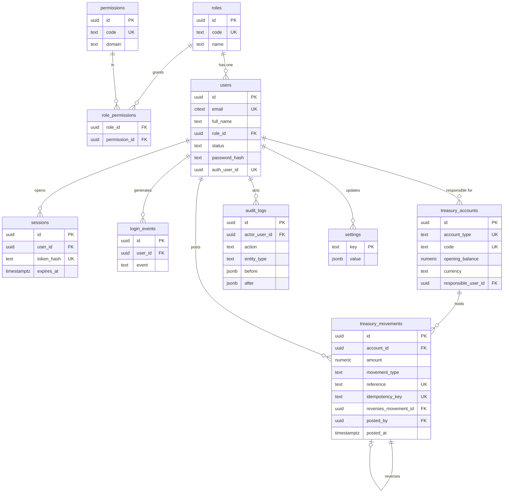

# SEPF Treasury — Data Model (Foundation milestone)

Scope: the tables, views and functions delivered for **Milestone 2 — Foundation**.
This is the §13 "recommended data model", narrowed to what the foundation needs
and extended with the constraints that make the §13.1 integrity rules real.
Technical names may be adjusted, but the logical separation and relationships
must be preserved (§13).

## Entity-relationship diagram

> Views (not shown above): **`treasury_balances`** (per-account derived balance)
> and **`treasury_consolidated`** (small + large + transit + total). Both use
> `security_invoker = true` so each caller's RLS applies.

## Table catalogue

| Table | Purpose | Key points |
|---|---|---|
| `roles` | The five business roles (§4). | `code` is a stable slug; not user-creatable in v1. |
| `permissions` | Atomic capabilities. | The §4.2 matrix, expressed as discrete codes (e.g. `income.record.small`). |
| `role_permissions` | Role → permission grants. | Composite PK; the editable matrix. |
| `users` | The five identified people. | One `role_id`; `status` suspends instantly; auth via `password_hash` **or** `auth_user_id`. Salary eligibility is **not** here (§8.1, later milestone). |
| `sessions` | Server-side expiring sessions (§14.2). | Only the token **hash** is stored; `expires_at > issued_at`. |
| `login_events` | Append-only login history (§14.2). | Captures failed attempts (`email_attempted`) with no user. |
| `treasury_accounts` | The three treasuries (§5). | One row per type (unique); `opening_balance numeric(18,0)`; `currency = 'XAF'`. |
| `treasury_movements` | **The immutable ledger.** | Signed `numeric(18,0)`; unique `reference` + `idempotency_key`; `reverses_movement_id` self-link; append-only. |
| `audit_logs` | Append-only audit trail (§2.1). | `before`/`after` JSONB; written by the transactional functions. |
| `settings` | Key/value configuration. | Seeds `session_ttl_minutes` and the Cashier `advance_disbursement_ceiling_fcfa`. |

## §13.1 mandatory integrity rules — traceability

| # | Rule | Status in foundation | Mechanism |
|---|---|---|---|
| 1 | Amounts as integers / `numeric(18,0)`, never float | ✅ Done | column types on movements & accounts |
| 5 | Unique idempotency key prevents duplicate movements | ✅ Done | `idempotency_key UNIQUE NOT NULL` + idempotent `post_treasury_movement()` |
| 10 | Financial movements are immutable | ✅ Done | `trg_block_modification` trigger + `SELECT`-only grant + RLS |
| 2 | Only one request **version** approved | ⏳ Later | pattern reserved (partial unique index) — requests milestone |
| 3 | A request has only one payment | ⏳ Later | payments milestone |
| 4 | Payment linked to approved version, equal amount | ⏳ Later | payments milestone |
| 6 | Advance ceiling between 0 and monthly salary | ⏳ Later | salary milestone; `settings` placeholder seeded |
| 7 | "Control not validated" needs a non-empty cause | ⏳ Later | control milestone (same pattern as the reversal-reason check, already implemented) |
| 8 | Capital contributions: only the two shareholders | ⏳ Later | capital milestone |
| 9 | Capital contribution has no loan/advance fields | ⏳ Later | capital milestone (separate table, no such columns) |
| 11 | Specialised ops linked to their request when approval is required | ⏳ Later | `source_type` / `source_id` / `movement_group_id` scaffolding present |

The foundation fully implements the rules that govern the **ledger itself**
(1, 5, 10) and lays the structural groundwork for the rest.

## §13.2 sensitive transactional functions — status

| Function (spec) | Status | Implementation |
|---|---|---|
| Record income and its financial movement | ✅ Done | `record_income()` |
| Create an adjustment or reversal | ✅ Done | `reverse_movement()` |
| (engine reused by all postings) | ✅ Done | `post_treasury_movement()` |
| Record a small expense already disbursed | ⏳ Later | requests/payments milestone |
| Pay an approved request in full | ⏳ Later | payments milestone |
| Record a validator / super-admin decision | ⏳ Later | requests milestone |
| Record the Accountant's accounting control | ⏳ Later | controls milestone |
| Initiate and confirm a transfer | ⏳ Later | transfers milestone (balanced legs via `post_treasury_movement()`) |
| Pay a salary advance / outstanding balance | ⏳ Later | salary milestone |
| Confirm a capital contribution | ⏳ Later | capital milestone |

## Forward-compatibility notes

- **`movement_type`** already enumerates the vocabulary for later milestones
  (transfers, salaries, investments, loans, borrowings, capital), so adding those
  features needs no ledger migration.
- **`source_type` / `source_id`** loosely link a movement to its business origin
  without a hard FK, keeping the generic ledger decoupled from every future
  object while still satisfying rule 11.
- **`movement_group_id`** ties the multiple legs of one business event together
  (e.g. the two legs of a transfer), which is how the consolidated total is kept
  invariant (§10.3).
