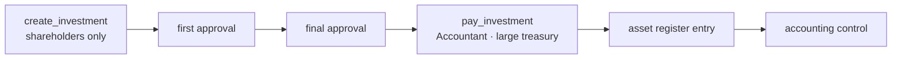
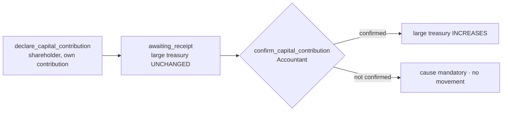

# SEPF Treasury — Investments & Capital (Milestone 6)

Scope: SEPF investments and their asset register (§9.1), and shareholder capital
contributions (§9.2). Validated on PostgreSQL 16 — see [Validation](#validation).

## SEPF investments (§9.1)

An investment **reuses the generic request/approval workflow** (request type
`investment`, the supplier as external beneficiary, large treasury), honouring
§13.1 rule 11. Only the two shareholders may create one.



- `create_investment` (`investment.create` → Super Admin / First-Level Validator).
- Approvals use the shared first/final validation functions.
- `pay_investment` (`investment.pay` → Accountant) pays the **full** approved
  amount from the large treasury, refuses on insufficient funds (§6.7), and
  materialises the **asset register** entry (`cost`, `acquired_on`, custodian,
  linked to the payment & movement). Idempotent — replay returns the same asset.
- `pay_request` **refuses** investments, forcing the dedicated path.
- The Accountant then runs the existing accounting control on the payment.

## Capital contributions (§9.2)

A contribution is **not** an expense request — it has its own two-step flow and
no loan/advance/repayment fields (§13.1 rule 9).



- `declare_capital_contribution` (`capital.contribute`) — only the two
  shareholders, each declaring their **own** contribution (§13.1 rule 8, also
  enforced by a DB trigger on the shareholder's role). The large treasury stays
  unchanged.
- `confirm_capital_contribution` (`capital.confirm` → Accountant) — on
  confirmation the large treasury **increases**; a refusal requires a cause and
  posts nothing. Idempotent; a processed contribution is immutable.
- `shareholder_capital_summary` gives the per-shareholder comparative view
  (awaiting / confirmed / not-confirmed). Recorded contributions do **not**
  change legal shareholding percentages (none are stored — informational only).

## Specification traceability

| Spec | Where enforced |
|---|---|
| §9.1 shareholders-only creation; dual approval; large decreases; asset record; linked to request | `create_investment` + shared validations + `pay_investment` + `assets` |
| §9.2 shareholders declare own; not an expense request | `declare_capital_contribution` (`capital.contribute` = the two roles) |
| §9.2 large unchanged until confirmed; increases on confirmation; cause if refused | `confirm_capital_contribution` |
| §9.2 separate histories + comparative summary | `shareholder_capital_summary` |
| §13.1 rule 8 only the two shareholders | permission + `trg_capital_shareholder_check` |
| §13.1 rule 9 no loan/advance/repayment fields | `capital_contributions` columns (by construction) |
| §13.2 "confirm a capital contribution" | `confirm_capital_contribution` |

## Validation

`db/tests/0005_investments_capital_checks.sql` (all pass):

- a non-shareholder cannot declare a contribution or create an investment;
- the large treasury stays unchanged on declaration and **increases only on
  confirmation**; a refusal needs a cause and posts nothing; confirm is idempotent;
- the comparative summary reports super = 1 000 000 confirmed, validator =
  500 000 not-confirmed;
- an investment cannot be paid via `pay_request`; only the Accountant pays;
  payment creates exactly one asset (idempotent) and the control has no effect.

Worked figures: large 5 000 000 → **6 000 000** (capital confirmed) → **4 000 000**
(2 000 000 truck investment); asset register shows the truck at cost 2 000 000.

```bash
for f in db/migrations/*.sql db/seed/*.sql; do psql -d sepf -f "$f"; done
psql -d sepf -f db/tests/0005_investments_capital_checks.sql
```

## Carried-forward open items

- Depreciation / disposal of assets is not modelled (not in the spec scope).
- Shareholding percentages are intentionally not derived from contributions
  (§9.2): they would need a separate legal cap-table if SEPF later wants one.
