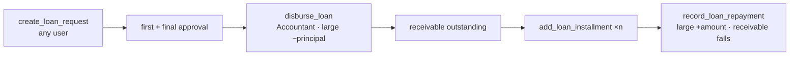
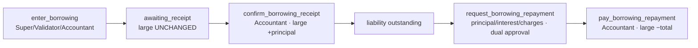

# SEPF Treasury — Loans, Borrowings & Reports (Milestone 7)

Scope: loans SEPF grants (§10.1), borrowings SEPF obtains (§10.2), and the
reporting / export-audit layer (§11). This completes the database backend.
Validated on PostgreSQL 16 — see [Validation](#validation).

## Loans granted by SEPF (§10.1)

A loan is a **receivable**, not an expense. It reuses the generic request/approval
workflow (type `loan`, external borrower, large treasury).



- `disburse_loan` (Accountant / `loan.disburse`) pays the full approved amount
  from the large treasury and posts a `loan_disbursement` movement — **no
  payments row**, because it is a receivable not an ordinary expense.
- `add_loan_installment` schedules full instalments (capped at the principal);
  `record_loan_repayment` posts a `loan_repayment` (large **+**), each in full.
- `loan_summary` exposes `principal`, `repaid`, `outstanding_receivable`.

## Borrowings obtained by SEPF (§10.2)

A borrowing is a **liability**. It is entered administratively (no request
workflow to create) but **credited only after the Accountant confirms receipt**.



- `confirm_borrowing_receipt` mirrors capital: confirm → large **increases**;
  refuse → cause mandatory, nothing posted; idempotent.
- A repayment is a **request** (type `borrowing_repayment`, dual approval) whose
  instalment **separates principal / interest / charges** (§10.2). `pay_request`
  refuses it, forcing the dedicated path.
- `pay_borrowing_repayment` (Accountant / `borrowing.repay`) pays the full total
  from the large treasury; the liability falls by the **principal** part only.
- `borrowing_summary` exposes principal, principal-repaid, interest-paid,
  charges-paid and `outstanding_liability`.

## Reports & exports (§11)

- `v_transaction_history` — the §11.1 timeline over the ledger, `security_invoker`
  so each caller sees only what their ledger RLS allows.
- `loan_summary` / `borrowing_summary` — receivables and liabilities (§11.3).
- `record_export(report_type, filters)` — logs every export to `audit_logs`
  (§11.3 "every export must be recorded in the audit trail"). The file itself is
  produced by the frontend from these read models.

## Specification traceability

| Spec | Where enforced |
|---|---|
| §10.1 any user requests; dual approval; full disbursement; receivable | `create_loan_request` + shared validations + `disburse_loan` (no payments row) |
| §10.1 schedule of full instalments; repayments raise treasury, cut receivable | `add_loan_installment` / `record_loan_repayment` + `loan_summary` |
| §10.2 entered by 3 roles; credited only on confirmation; liability | `enter_borrowing` + `confirm_borrowing_receipt` |
| §10.2 repayment needs request + dual approval + full payment | `request_borrowing_repayment` + `pay_borrowing_repayment` |
| §10.2 instalment separates principal/interest/charges | `borrowing_installments` columns |
| §11.1 history timeline; §11.3 exports + audited | `v_transaction_history`, summaries, `record_export` |

## Validation

`db/tests/0006_loans_borrowings_checks.sql` (all pass):

- a loan is disbursed only by the Accountant; the receivable then falls to 0 as
  instalments are received (large 5 000 000 → 4 000 000 → back to 5 000 000);
- a borrowing leaves the treasury unchanged until confirmed, then **increases**
  it (→ 7 000 000); the liability falls by principal only on repayment;
- principal repaid cannot exceed the liability; scheduling cannot exceed the loan;
- repayments cannot bypass their dedicated path; role checks hold;
- an export is rejected without `report.export` and is otherwise audited.

Worked end state: large treasury **6 440 000**; loan outstanding **0**; borrowing
outstanding liability **1 500 000** (principal 500 000 repaid, plus 50 000
interest and 10 000 charges).

```bash
for f in db/migrations/*.sql db/seed/*.sql; do psql -d sepf -f "$f"; done
psql -d sepf -f db/tests/0006_loans_borrowings_checks.sql
```

## Carried-forward open items

- Interest on **loans granted** is not modelled (the spec mentions interest only
  for borrowings, §10.2); repayments reduce the principal receivable.
- Report file generation (PDF/Excel/CSV) and notification delivery channels are
  frontend/integration concerns for a later milestone; the backend provides the
  data and the audit record.
