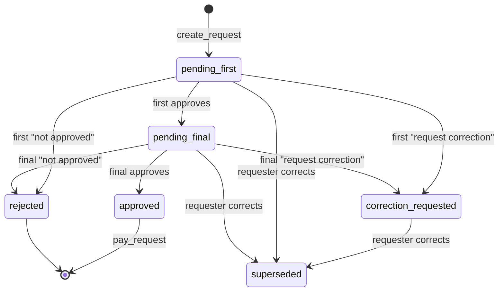
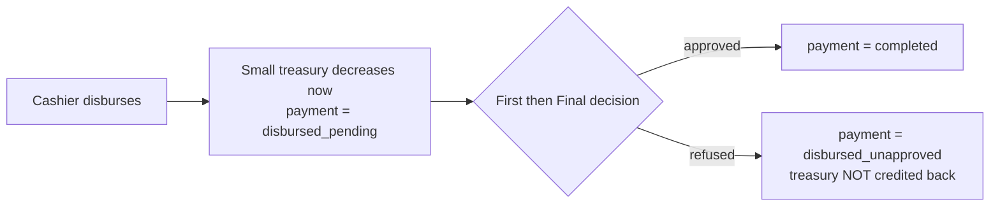

# SEPF Treasury — Requests & Expenses (Milestone 3)

Scope: the request lifecycle (§6), the universal two-step approval workflow
(§4.1), full-only payments (§6.7), and the Cashier's pre-approval disbursement
(§6.5). Builds directly on the foundation ledger; all writes go through
`SECURITY DEFINER` functions, decisions are append-only, and balances stay
derived. Validated on PostgreSQL 16 — see [Validation](#validation).

## Request-version state machine

A correction never edits a version; it **supersedes** it and creates the next
one (§6.3). Only the *status* of a version may change after creation (enforced by
a trigger); every business field is frozen.



Two partial unique indexes keep the discipline:

- `uq_one_approved_version` — **at most one approved version** per request (§13.1 rule 2).
- `uq_one_live_version` — at most one in-flight version (`pending_*` /
  `correction_requested`), so corrections supersede cleanly.

## Function catalogue

| Function | Who (permission) | What it enforces |
|---|---|---|
| `create_request(…)` | any role (`request.create`) | Creates the request + version 1 (`pending_first`). Amount > 0; beneficiary internal⇒user, external⇒name. |
| `create_request_correction(…)` | the requester | New version (§6.3); blocked once a payment/disbursement exists; supersedes the live version. |
| `record_first_validation(version, decision, comment)` | First-Level Validator (`request.approve.first`) | Acts only on `pending_first`; comment mandatory unless *approve* (§6.2). |
| `record_final_validation(version, decision, comment)` | Super Administrator (`request.approve.final`) | Acts only on `pending_final` — i.e. **after** first approval (§6.2). Marks `approved`. |
| `pay_request(request, key)` | Cashier (small) / Accountant (large) | Approved version only; pays **the exact approved amount** from **its** treasury; insufficient balance ⇒ nothing paid (§6.7); one payment per request; idempotent. |
| `disburse_small_advance(request, key)` | Cashier (`expense.disburse_advance`) | §6.5 path: posts the movement **before** approval; small treasury only. |
| `apply_validation(…)` | *internal* | Shared decision engine; not granted to `app_user`. |

Self-approval is permitted (§4.1) but every decision stores
`is_self_decision = (approver = requester)` so the dual role is visible in the
timeline and audit trail.

## The advance-disbursement path (§6.5)



A refusal **never** credits the treasury again and triggers no automatic refund
(§6.5); the expense stays visible as *disbursed – not approved*. Corrections are
blocked once an advance exists (the amount is already committed).

## Specification traceability

| Spec | Where enforced |
|---|---|
| §6.1 request form + unique reference | `requests` / `request_versions`; `REQ-YYYY-NNNNNN` |
| §6.2 decisions; final only after first; comment mandatory | `apply_validation` status guard + `chk_comment_required` |
| §6.3 correction = new version; previous kept | `create_request_correction` + field-freeze trigger |
| §6.5 small expense already disbursed | `disburse_small_advance` + reconciliation in `apply_validation` |
| §6.7 no partial payment; pay = approved amount | `pay_request` computes amount from the approved version |
| §13.1 rule 2 (one approved version) | `uq_one_approved_version` |
| §13.1 rule 3 (one payment) | `payments.request_id UNIQUE` |
| §13.1 rule 4 (payment = approved version & amount) | `pay_request` links the approved version, equal amount |
| §13.1 rule 11 (op linked to its request) | `payments` → version; movement `source_type='payment'` |

## Validation

`db/tests/0002_requests_checks.sql` exercises every §17.1 mandatory scenario for
this milestone; all pass:

- normal small expense (approve → approve → pay; balance 150 000 → 100 000);
- large expense (Accountant pays; 5 000 000 → 4 000 000);
- **insufficient funds** → nothing paid, request stays pending (§6.7);
- correction → new version; the superseded version can no longer be approved;
- **self-approval** recorded with `is_self_decision = true` (§4.1);
- advance disbursed then **refused** → `disbursed_unapproved`, treasury unchanged;
- advance disbursed then **approved** → `completed`, no double movement;
- role checks (Accountant can't pay small, Cashier can't pay large, Operations
  Director can't approve) and RLS (a non-owner without `request.read.all` sees
  nothing).

Final reconciled state: small **35 000**, large **4 000 000**, total
**4 035 000**; 4 completed payments + 1 disbursed-unapproved.

```bash
for f in db/migrations/*.sql db/seed/*.sql; do psql -d sepf -f "$f"; done
psql -d sepf -f db/tests/0002_requests_checks.sql
```

## Carried-forward open items

The decisions flagged in `ARCHITECTURE.md §6` still apply. New to this milestone:
**treasury routing** — the requester proposes small/large and that choice drives
who pays; the spec defines no amount threshold to prevent a large expense being
routed through the small treasury, so none is imposed yet (flag for SEPF).
