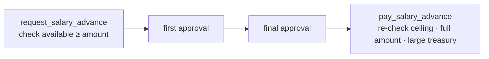

# SEPF Treasury — Salaries & Advances (Milestone 5)

Scope: per-user salary configuration (§8.1), monthly cycles, salary advances with
the anti-overrun ceiling (§8.2), and outstanding-balance settlement that carries
debt forward (§8.3). Validated on PostgreSQL 16 — see [Validation](#validation).

## Configuration (§8.1)

`salary_profiles` is an append-only, effective-dated history per user, set only by
the Super Administrator via `set_salary_profile` (`salary.configure`). Salary
entitlement is **independent of the application role**. The advance ceiling is
bounded by the salary (`chk_ceiling_within_salary` = §13.1 rule 6). A change is a
new row; existing cycles keep the values **snapshotted** when they were opened, so
edits have no retroactive effect.

## Cycles and the derived figures

`salary_cycles` holds one row per (user, month), snapshotting `monthly_salary`,
`advance_ceiling` and `can_request_advance`. Everything else is **derived from
payments** (never stored editable), via `salary_cycle_summary`:

| Figure | Formula (§8.2/§8.3) |
|---|---|
| `advances_paid` | Σ completed advance payments in the cycle |
| `advances_approved_unpaid` | Σ approved-but-unpaid advances in the cycle |
| `advance_available` | `ceiling − advances_paid − advances_approved_unpaid` |
| `balance_paid` | Σ balance settlements for the cycle |
| `outstanding_balance` | `monthly_salary − advances_paid − balance_paid` |

## Salary advance (§8.2)

An advance **reuses the generic request/approval workflow** (a request of type
`salary_advance`, internal beneficiary = the user, large treasury), honouring
§13.1 rule 11. The lifecycle:



- **Creation** checks the amount fits `advance_available` (§8.2).
- **Approvals** use the shared `record_first_validation` / `record_final_validation`.
- **Payment** (`pay_salary_advance`, Accountant / `salary.pay`) repeats the ceiling
  check transactionally (§8.2), pays the **full** amount from the large treasury,
  and refuses if the treasury is insufficient (§6.7). One payment per request.
- `pay_request` now **refuses** salary advances, forcing the ceiling-checked path.

Multiple advances per month are allowed; the invariant *paid + approved-unpaid ≤
ceiling* is preserved at every step.

## Outstanding balance (§8.3)

`pay_salary_balance` (Accountant / `salary.pay`) settles a cycle's
`outstanding_balance` in **full** from the large treasury. If the treasury cannot
cover it, **nothing is paid and the amount remains due**. A new month is a new
cycle and never deletes prior debt — an unpaid cycle keeps its outstanding figure
indefinitely. `open_salary_cycle` lets the salary-runner open a month for a user
who took no advance.

## Specification traceability

| Spec | Where enforced |
|---|---|
| §8.1 per-user config, role-independent, history, no retroactive effect | `salary_profiles` (append-only, effective-dated) + `set_salary_profile` |
| §13.1 rule 6 ceiling ≤ salary | `chk_ceiling_within_salary` |
| §8.2 available = ceiling − paid − approved-unpaid; full payment; re-check at pay | `salary_cycle_summary` + `request_salary_advance` + `pay_salary_advance` |
| §8.2 cumulative ≤ ceiling, multiple requests | invariant enforced at create + pay |
| §8.3 outstanding = salary − advances; full; remains due; new cycle keeps debt | `pay_salary_balance` + per-cycle snapshots |
| §8.3 totals from payments, not editable | derived views + append-only payment tables |
| §13.2 "pay a salary advance or outstanding balance" | `pay_salary_advance` / `pay_salary_balance` |

## Validation

`db/tests/0004_salaries_checks.sql` (all pass):

- only the Super Admin configures salaries; ceiling > salary is rejected;
- an advance over the available ceiling is rejected at request **and** the
  monthly cumulative never exceeds the ceiling (§17.1 "Salary advance");
- a salary advance cannot be paid via `pay_request`; only the Accountant pays;
- the outstanding balance is settled in full, and an unpaid balance **remains due
  when the month changes** (§17.1 "Outstanding salary");
- an insufficient large treasury pays nothing and the balance stays due (§8.3);
- a user whose profile forbids advances cannot request one.

Worked figures: salary 200 000, ceiling 100 000; advances 60 000 + 30 000 paid →
available 10 000; June outstanding 110 000 settled → 0; large treasury 5 000 000 →
4 800 000; a 9 000 000 salary stays fully due against the smaller treasury.

```bash
for f in db/migrations/*.sql db/seed/*.sql; do psql -d sepf -f "$f"; done
psql -d sepf -f db/tests/0004_salaries_checks.sql
```

## Carried-forward open items

- **Detailed statutory payroll** (taxes, social contributions) is explicitly out
  of scope for v1 (§3.2); only the net salary/advance/balance is modelled.
- Cycle opening is currently manual (`open_salary_cycle` / first advance); a
  scheduled monthly opening can be added if SEPF wants it.
